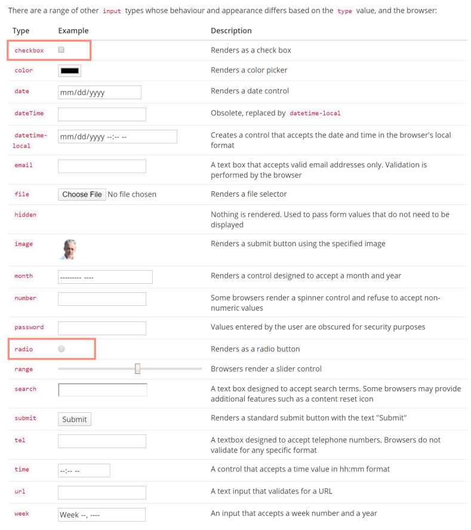

Summary of Form Processing
====

Basic HTML Form
----

```html
    <form method="post">
        ...
        <button>Submit</button>
    </form>
```

- The primary role of a form is to capture user inputs and to transfer them to the web server.

- Form-Controls: input, select, textarea ... are elements designed to accept user inputs for submission.

- Input Element Types



Ways to Access User Input (Server Side)
----

1. Using **`Request.Form`** collection via the string-based index -- the value of the **`name`** attribute of the form control.

    ```dotnet

        <form method="post">
            <input type="email" name="emailAddress">
            <input type="submit">
        </form>

        // in PageModel
        public void OnPost()
        {
            var emailAddress = Request.Form["emailAddress"];
            //...
        }
    ```

2. Using **Model Binding** to map form fields to **handler method** parameters.

    ```dotnet

        <form method="post">
            <input type="email" name="emailAddress">
            <input type="submit">
        </form>

        // in PageModel
        public void OnPost(string emailAddress) // <<< Model Binding
        {
            //...
        }
    ```

3. Using **Model Binding** to map form fields to **Public Properties** on the PageModel class.

    ```dotnet

        <form method="post">
            <input type="email" name="emailAddress">
            <input type="submit">
        </form>

        // in PageModel
        [BindProperty]
        public string EmailAddress {get; set;} // <<< Model Binding
        public void OnPost()
        {
            //...
        }
    ```

Tag Helper form HTML form generation
----

- The **form, input, select and textarea** elements are all targets of Tag helpers, components that extend the HTML element to provide custom attributes which are used to control the HTML generation.

- The most important attribute is the **asp-for** attribute that takes the name of a PageModel property. By that, the generated form-control will have correct name attribute so that form values are bound correctly to the model when the form is posted back to the server.

    ```dotnet

        <input type="email" asp-form="EmailAddress">

        // Generated HTML
        <input type="text" id="EmailAddress" name="EmailAddress" value=""i/>

        [BindProperty]
        public string EmailAddress {get; set;} // <<< Model Binding
        public void OnPost()
        {
            //...
        }
    ```

Handling Checkboxes (`<Input type="checkbox" checked>`)
----

- As with any **form field**, the checkbox needs a **name** attribute specified so that its a value can be submitted.

```dotnetcli
    <input type="checkbox" name="myCheckbox">
```

Generate Checkboxes
----

1. input tag helper

```dotnet

    // cshtml
    <input asp-for="IsChecked">

    // PageModel
    public class IndexModel:PageModel
    {
        public bool IsChecked {get; set;}
    }

    // HTML, generated
    <input  type="checkbox" 
            data-val="true" 
            data-val-required="The IsChecked field is required." 
            id="IsChecked" 
            name="IsChecked" 
            value="true">
    <input name="IsChecked" type="hidden" value="false">
```

2. Html.CheckBox() / Html.CheckBoxFor() helper method 

```dotnet
    @Html.CheckBox("IsChecked")
    @Html.CheckBoxFor(model=>model.IsChecked)

```
