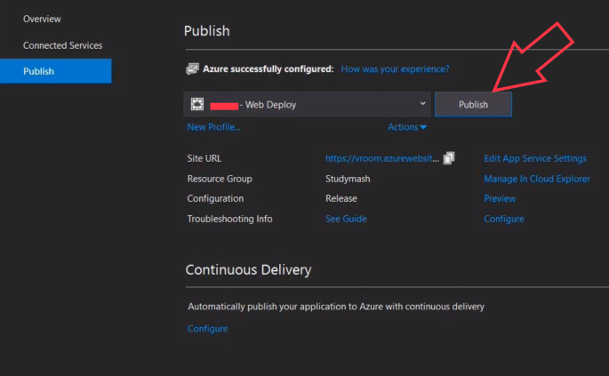

# Deployments to IIS and Azure

Issue 1 - After deploying to IIS
----

- Problem:

    + After initial deployments to both IIS and [Azure](https://bikeexchange.azurewebsites.net), got

    

    + Put in web.config:
    ```
    <environmentVariables>
        <environmentVariable name="ASPNETCORE_ENVIRONMENT" value="Development" />
    </environmentVariables>
    ```
    
    

    + Gotten Exception Details

    

- Cause of the Problem:

    + During development, the SQL server connection string uses "Window Authentication", like: server=.\\SQLEXPRESS; database=BikeDB; Trusted_Connection=True"

    + Then, after deployment, then Web Application tried to use user, 'IIS APPPOOL\BikeExchange', to login into the SQL server, but there is no such an account in SQL Serer.

- Solution:

    + Use SQL Server Authentication in Database Connection String!!!
    + "BikeDbConnection": "server=.\\SQLEXPRESS; database=bikedb; User Id=sa password=nopass"

Steps to Enable "sa" for SQL Express
----

0) By default, when SQL Express installed, Windows Authentication is used.
1) Bring up "SQL Server Management Studio"
2) Change "sa" password:

    
    

3) Enable "sa" login

    

4) Enable "SQL Server Authentication"

    


[Deployment Asp.Net Core with SQL Server, to Azure](https://docs.microsoft.com/en-us/azure/app-service/app-service-web-tutorial-dotnetcore-sqldb)
----

- Steps to Deploy to Azure

    + Firewall setting

    1. Create an Azure SQL database
        + create a **resource group**

    2. Update the Connection String to point to Azure's database
    3. Do **"update-database"** to migrate database schema (no data)

    4. Use SSMS to deploy our database (local)  to Azure SQL Database along with our data!

        + Connect to local databsae
        + Select **Tasks=>Deploy Database to Microsoft Azure SQL Databsae...**
        

    5. Deploy WebApp (ASP.Net Core MVC) to App Service

        + In Visual Studio, right click on he project to be publish to Azure
        + Select **Publish**, pick **App Service**
        + For local IIS publishing, use "Folder"

        

        + Create a profile (1st time)
        + Then, click **Publish**

        

Issue 2 - After deploying to Azure
----

- Like deploying to IIS, encounter error when try to login

    

- Cause of the problem:

    + No Connection String, so need to set it via **Azure Cloud Shell (Bash or Powershell)**

    ```azurecli-interactive
    az webapp config connection-string set
    --resource-group <groupName>
    --name BikeExchange
    --settings
        BikeDbConnection="Server=tcp:bikedbserver88.database.windows.net,1433;
        Initial Catalog=BikeDBNew;
        Persist Security Info=False;
        User ID=<admin-name>;
        Password=<password>;
        MultipleActiveResultSets=False;
        Encrypt=True;
        TrustServerCertificate=False;
        Connection Timeout=30;"
    --connection-string-type SQLServer
    ```

    + Firewall setting for SQL Database was not right, corrected.

    

    + In order to find out insight into the error we initially gotten, we need to:

    ```azurecli-interactive
    az webapp config appsettings set 
        --name BikeExchange 
        --resource-group <resource-group-name> 
        --settings ASPNETCORE_ENVIRONMENT="Development"
    ```
    + then we got the following, which point to firewall problem

    
