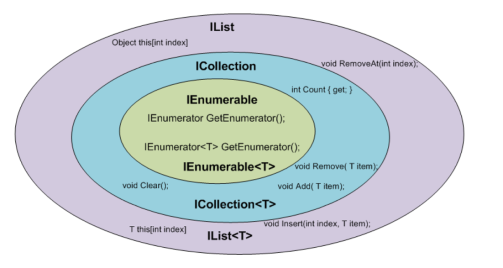
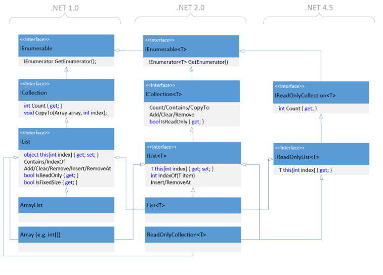

Collection Interfaces (Generics)
====

- C# provides many collection interfaces, abstracting collections, and they are for different "purposes".

1. IEnumerable`<T>`
2. ICollection`<T>`
3. IList`<T>`
4. IList, by the way, int[] implements IList!!!!

    ```dotnetcli
    public class List<T> :
        System.Collections.Generic.ICollection<T>,
        System.Collections.Generic.IEnumerable<T>,
        System.Collections.Generic.IList<T>,
        System.Collections.Generic.IReadOnlyCollection<T>, System.Collections.Generic.IReadOnlyList<T>,
        System.Collections.IList // <<<<
    ```

5. there are others like IDicitonary<TKey, TValue>

Summary
----

- IEnumerable`<T>`
  - Readonly, just for Enumeration.
  - No indexer, no (.Count, .Contains,...)

- ICollection`<T>`
  - Resizable (.Add, .Remove, .Clear, .Count...) 
  - No indexer.

- IList`<T>`
  - With Indexer
  - Resizable (.insert, . RemoveAt)




IEnumerable`<T>`
----

IEnumerator`<T>`:
  T Current
  bool MoveNext( )
  void Reset ( )

IEnumerable`<T>`:
  IEnumerator`<T>` GetEnumerator ( )

ICollection`<T>`: IEnumerable`<T>`
  bool Contains(T element)
  void Add(T element)
  bool Remove(T element)
  void Clear()
  void CopyTo(T[] targetArray, int targetArrayStartIndex)
  int Count
  bool IsReadOnly

IList`<T>`: ICollection`<T>`, IEnumerable`<T>`
  T this[int index]
  int IndexOf(T element)
  void Insert(int index, T element)
  void RemoveAt(int index)
