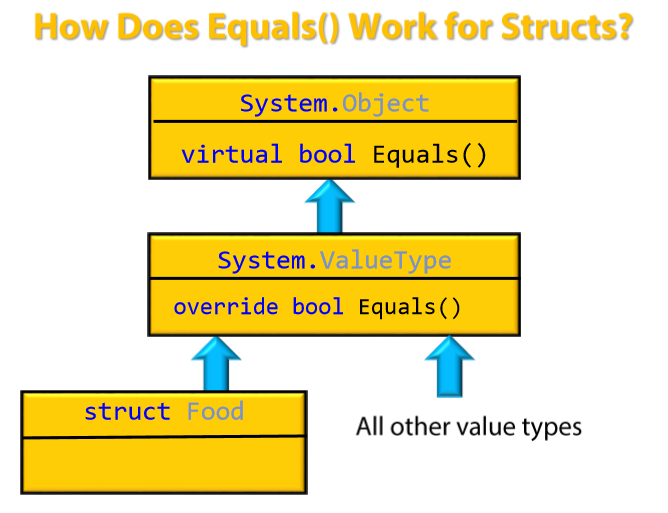
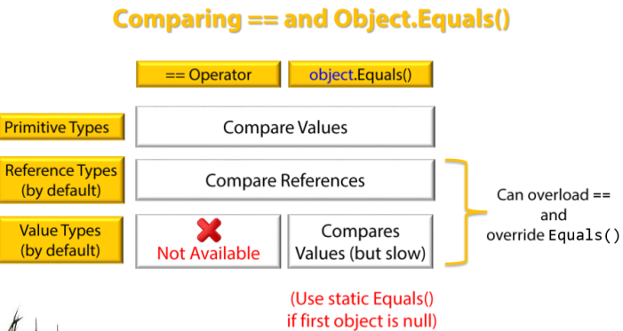

C# - Equality and Comparisons
====

Factors to Consider
----

- **C# vs .Net**

  - "==" is provided by C#, not .Net, which has no concept of operators.
  - Equals() is .Net thing.

- **Out-of-the-Box Equality and Comparisons vs Customized**

- **Equality and Comparison Operators**

  Equality
  : Concern with Equals between two entities (of Value Types and Reference Types), with Equality Operator == and !=

  Comparison
  : Deal with ordering, using operators <, >, <=, >=

- **What is Equality?**
  
  - Value Equality (aka Same Value) vs Reference Equality (aka Same Memory Location)
  - Context of Equality: ignore case? ignore whitespace? "Hello" =?= "hello":w
  - Floating point
  - OOP (Inheritance) - Type Safety - Equality Operator (==)
    - Could not achieve all 3 at the same time!
    - Could only pick 2 to support at the same time.

- **Value Types vs Reference Types**

  1. Value Types: Value Equality Only

  - Primitive Value Types: int, float, bool, char, enum, etc., built-in and out-of-box 
  - Other Value Types, like Structure, need customization

  2. Reference Types: Could be Reference Equality (default) **or** Value Equality

  - String (doing value equality)
  - Delegate(doing value equality)
  - Tuple (doing value equality)
    - Because the above override the object.Equals() to do Value Equality!
  - Class
  - Interface

- **Object Methods**

    ```csharp
    static bool Equals(object o1, object o2);   // handles null, and calls virtual Equals(...)
    static bool ReferenceEquals(object o1, object o2); // always does Reference Equality
    bool virtual Equals(object o);  // to be overridden
    virtual int GetHashCode();      // to be overridden, used for collection, like Dictionary
    ```

- **Interfaces (for Equality and Comparisons)**

|  | Equality <br> (not suitable for double, float, decimal) | Comparison|
|---|--- | ---|
|**"Natural"**|**IEquatable`<T>`** <br> bool Equals(T other)<br> ==, != operators|**IComparable`<T>`**<br>int CompareTo(T other)<br><, > etc. operators<br> **IComparable**<br> int CompareTo(object obj) |
|**"Plugged-in"**|**IEqualityComparer`<T>`**<br>bool Equals(T x, T y)<br>int GetHashCode(T obj) <br> **IEqualityComparer**<br>bool Equals(object x, object y)<br>int GetHashCode(object obj)|**IComparer`<T>`**<br>int Compare(T x, T y) <br> **IComparer**<br>Compare(object x, object y) |
|**"Structural"**|**IStructuralEquatable**<br>bool Equals(object ohter, IEqualityComparer comparer)<br>int GetHashCode(IEqualityComparer comparer)|**IStructuralComparable**<br>int CompareTo(object other, IComparer comparer)|

Equality in .Net
----

- static object.Equals(object o1, object o2); // intended to handle nulls; calls the virtual o1.Equals(o2) internally, so the overridden object.Equals() is always consistent with the static object.Equals()

- However, object.Equals() both static and virtual are 
  - not Type-Safe and needed Boxing
  - usually compare references, if not overridden

- IEqutable<T> solved the Boxing and Type-Safety issues

- static object.ReferenceEquals() always does reference equality check

- System.ValueType, which all Value Types inherited from, including Struct, override the object.Equals() so that it can do Value Equality for every contained fields, via Reflection.




- To avoid Reflection (costly), best to override object.Equals for your Value Types.

- What static bool object.Equals() does?

```csharp
    public static bool Equals(object o1, object o2)
    {
        if (o1 == o2)   // if they are the same, include both null
            return true;
        if (o1 == null || o2 == null)   // one of them null
            return false;

        return o1.Equals(o2);   // calling the virtual Equals()!!!!
    }
```

- Implementing IEquatable<T> will have Type-Safety and No need for Boxing

```csharp
public class T: IEquatable<T>
{
    public bool Equals(T other) // no boxing is needed
    {
        ...
    }
}
```

- **IEquatable<T> very useful for Value Types**, yet **NOT GOOD** for Reference Types

  - Int32, Byte Struct, etc. implement IEquatable<T>
  - String (although is a Reference type) also implements IEquatable<T>, due to String is a sealed class.

- **IMPORTANT** Equality Should Be Consistent!

```csharp
public class T: IEquatable<T>
{
    // both should do the same!
    public override bool Equalls(object other) {...}    // object.Equals()
    public bool Equals(T other) {...}   // for IEquatable<T>
    // ...
}
```

- Note: ReferenceEquals() on the other hand always compare references

== in C#
----

- object.Equals() and "==" are **NOT the SAME**
- Values Types can't use == unless it been overloaded
- == operator does not work well with: Inheritance and Generics

- How to overload ==?

```csharp
class AType
{
    public static bool operator == (AType lhs, AType rhs)
    {
        // ...
    }
    // In IL, == becomes a special static method called op_Equality()
}
```

- Override object.Equals(), should also overload ==, doing the same thing




Overriding Equality: Value Types (Struct)
----

- Why?
- Unless overriding the "==", it won't work for Value Types
- Avoid Boxing and Reflection
- Customize Equality, by default Equality is calling Equals() on all fields, if all Equal, return true.

- What need to be done?

    1. Override object.Equals() to avoid reflection
    2. Implement IEquatable<T> to avoid boxing and provide type-safety
    3. Implement == and != to allow using ==, !==
    4. Implement object.GetHashCode(), for collection

- [Example](https://pluralsight.com): 

    ```csharp
    public enum Foodgroup { meat, fruit, vegetables, sweets }

    public struct FoodItem : IEquatable<FoodItem>
    {
        // 1. 
        public override bool Equals(object obj)
        {
            if (obj is FoodItem)
                return Equals((FoodItem)obj);   // call the IEquatable<T>'s Equals()
            else
                return false;
        }

        // 2. IEquatable<T>, actual equality logic is here
        public bool Equals(FoodItem other)  // IEquatable<T>
        {
            return this._name == other.Name && 
                   this._group == other._group;
        }

        // 3.
        public static bool operator ==(FoodItem lhs, FoodItem rhs)
        {
            return lhs.Equals(rhs);
        }

        public static bool operator !=(FoodItem lhs, FoodItem rhs)
        {
            return !lhs.Equals(rhs);
        }

        // 4. XOR fields' HashCodes
        public override int GetHashCode()
        {
            return _name.GetHashCode() ^ _group.GetHashCode();
        }

        private readonly string _name;
        private readonly FoodGroup _group;

        public string Name { get { return _name; } }
        public FoodGroup Group { get { return _group; } }

        public FoodItem(string name, FoodGroup group)
        {
            this._name = name;
            this._group = group;
        }

        public override string ToString()
        {
            return _name;
        }
    }

    ```

Overriding Equality: Reference Types
----


Comparisons in .Net
----


Strings
----


Comparers and Equality Comparers
----


HashCode
----


Structural Equality
----


- String is special, == performs value equality

```C#
    string str1 = "Value Checked";
    string str2 = string.copy(str1);
    str1==str2 // returns true.

    // But
    int i=10;
    int i1 = 10;

    i == i1 // returns true
    (object)i == (object) i1 // returns false
    (IComparable<int>) i == (IComparable<int>) i1 // returns false

    // But
    string str1 = "string"
    string str2 = "STRING"

    str1 ==str2 returns false
    str1.Equals(str2,StringComparison.OrdinalIgnoreCase) // returns true.
```

- Equality

  - Natural Equality - IEquatable<T> (String Implements)

    ```csharp
        IEquatable<T>
            bool Equals(T other)
    ```

  - Plugged-in Equality - IEqualityComparer<T>

    ```csharp
        IEqualityComparer<T>
            bool Equals(T x, T y)
            int GetHashCode(T obj)
    ```

- Comparison

  - Natural Comparison - IComparable<T>

    ```csharp
        IComparable<T>
            int CompareTo(T other)
    ```

  - Plugged-in Comparison
    
    ```csharp
        IComparer<T>
            int Compare(T x, T y)
    ```

- Object Reference Equality Comparison

    ```csharp
        objectA.Equals(objectB)
    ```

Equality Operator "==" (C#)
---

|Type | == |
|-----| ---|
|Ref.Type| Reference Equality|
|String| Value Equality|
|Value Type| Value Equality|
|Delegate| Value Equality|
|Tuple| Value Equality|

- Casting Value to Interface becomes Reference Type

Virtual Object.Equals (.Net Framework)
----

- Null is always equal to another Null


[Flash Cards](https://quizlet.com/156000898/c-equality-and-comparisons-flash-cards/)
[Equality Story](https://www.c-sharpcorner.com/article/story-of-equality-in-net-part-one/)
  


String has these Methods
----

```csharp

    public override bool Equals(object? obj);
    public bool Equals(String? value);
    public static bool Equals(String? a, String? b);

    public static bool Equals(String? a, String? b, StringComparison comparisonType);
    public bool Equals(String? value, StringComparison comparisonType);

    public static bool operator ==(String? a, String? b);
    public static bool operator !=(String? a, String? b)
```