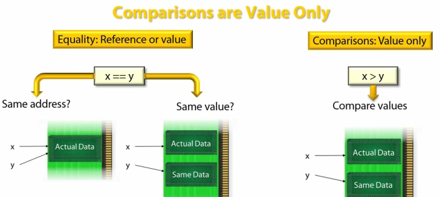

C# - Equality and Comparisons
====

Factors to Consider
----

- == and !== work out of box for primitive and reference types
- <, >, <=, >= ONLY work out of box for primitive types, NOT reference types

- **C# vs .Net**

  - "==" is provided by C#, not .Net, which has no concept of operators.
  - Equals() is .Net thing.

- **Out-of-the-Box Equality and Comparisons vs Customized**

- **Equality and Comparison Operators**

  Equality
  : Concern with Equals between two entities (of Value Types and Reference Types), with Equality Operator == and !=

  Comparison
  : Deal with ordering, using operators <, >, <=, >=

- **What is Equality?**
  
  - Value Equality (aka Same Value) vs Reference Equality (aka Same Memory Location)
  - Context of Equality: ignore case? ignore whitespace? "Hello" =?= "hello":w
  - Floating point
  - OOP (Inheritance) - Type Safety - Equality Operator (==)
    - Could not achieve all 3 at the same time!
    - Could only at most pick 2 to support at the same time.

- **Value Types vs Reference Types**

  1. Value Types: Value Equality Only

  - Primitive Value Types: int, float, bool, char, enum, etc., built-in and out-of-box 
  - Other Value Types, like Structure, need customization

  2. Reference Types: Could be Reference Equality (default) **or** Value Equality

  - String (doing value equality)
  - Delegate(doing value equality)
  - Tuple (doing value equality)
    - Because the above override the object.Equals() to do Value Equality!
  - Class
  - Interface

- **Object Methods**

    ```csharp
    static bool Equals(object o1, object o2);   // handles null, and calls virtual Equals(...)
    static bool ReferenceEquals(object o1, object o2); // always does Reference Equality
    bool virtual Equals(object o);  // to be overridden
    virtual int GetHashCode();      // to be overridden, used for collection, like Dictionary
    ```

- **Interfaces (for Equality and Comparisons)**

|  | Equality <br> (not suitable for double, float, decimal) | Comparison|
|---|--- | ---|
|**"Natural"**|**IEquatable`<T>`** <br> bool Equals(T other)<br> ==, != operators|**IComparable`<T>`**<br>int CompareTo(T other)<br><, > etc. operators<br> **IComparable**<br> int CompareTo(object obj) |
|**"Plugged-in"**|**IEqualityComparer`<T>`**<br>bool Equals(T x, T y)<br>int GetHashCode(T obj) <br> **IEqualityComparer**<br>bool Equals(object x, object y)<br>int GetHashCode(object obj)|**IComparer`<T>`**<br>int Compare(T x, T y) <br> **IComparer**<br>Compare(object x, object y) |
|**"Structural"**|**IStructuralEquatable**<br>bool Equals(object ohter, IEqualityComparer comparer)<br>int GetHashCode(IEqualityComparer comparer)|**IStructuralComparable**<br>int CompareTo(object other, IComparer comparer)|

Equality in .Net
----

- static object.Equals(object o1, object o2); // intended to handle nulls; calls the virtual o1.Equals(o2) internally, so the overridden object.Equals() is always consistent with the static object.Equals()

- However, object.Equals() both static and virtual are 
  - not Type-Safe and needed Boxing
  - usually compare references, if not overridden

- IEquatable<T> solved the Boxing and Type-Safety issues

- static object.ReferenceEquals() always does reference equality check

- System.ValueType, which all Value Types inherited from, including Struct, override the object.Equals() so that it can do Value Equality for every contained fields, via Reflection.


- To avoid Reflection (costly), best to override object.Equals for your Value Types.

- What static bool object.Equals() does?

```csharp
    public static bool Equals(object o1, object o2)
    {
        if (o1 == o2)   // if they are the same, include both null
            return true;
        if (o1 == null || o2 == null)   // one of them null
            return false;

        return o1.Equals(o2);   // calling the virtual Equals()!!!!
    }
```

- Implementing IEquatable<T> will have Type-Safety and No need for Boxing

```csharp
public class T: IEquatable<T>
{
    public bool Equals(T other) // no boxing is needed
    {
        ...
    }
}
```

- **IEquatable<T> very useful for Value Types**, yet **NOT GOOD** for Reference Types

  - Int32, Byte Struct, etc. implement IEquatable<T>
  - String (although is a Reference type) also implements IEquatable<T>, due to String is a sealed class.

- **IMPORTANT** Equality Should Be Consistent!

```csharp
public class T: IEquatable<T>
{
    // both should do the same!
    public override bool Equalls(object other) {...}    // object.Equals()
    public bool Equals(T other) {...}   // for IEquatable<T>
    // ...
}
```

- Note: ReferenceEquals() on the other hand always compare references

== in C#
----

- object.Equals() and "==" are **NOT the SAME**
- Values Types can't use == unless it been overloaded
- == operator does not work well with: Inheritance and Generics

- How to overload ==?

```csharp
class AType
{
    public static bool operator == (AType lhs, AType rhs)
    {
        // ...
    }
    // In IL, == becomes a special static method called op_Equality()
}
```

- Override object.Equals(), should also overload ==, doing the same thing


Overriding Equality: Value Types (Struct)
----

- Why?
- Unless overriding the "==", it won't work for Value Types
- Avoid Boxing and Reflection
- Customize Equality, by default Equality is calling Equals() on all fields, if all Equal, return true.

- What need to be done?

    1. Override object.Equals() to avoid reflection
    2. Implement IEquatable<T> to avoid boxing and provide type-safety
    3. Implement == and != overloads to allow using ==, !==
    4. Implement object.GetHashCode(), for collection

- [Example](https://pluralsight.com): 

    ```csharp
    public enum Foodgroup { meat, fruit, vegetables, sweets }

    public struct FoodItem : IEquatable<FoodItem>
    {
        // 1. 
        public override bool Equals(object obj)
        {
            if (obj is FoodItem)
                return Equals((FoodItem)obj);   // call the IEquatable<T>'s Equals()
            else
                return false;
        }

        // 2. IEquatable<T>, actual equality logic is here
        public bool Equals(FoodItem other)  // IEquatable<T>
        {
            return this._name == other.Name && 
                   this._group == other._group;
        }

        // 3.
        public static bool operator ==(FoodItem lhs, FoodItem rhs)
        {
            return lhs.Equals(rhs);
        }

        public static bool operator !=(FoodItem lhs, FoodItem rhs)
        {
            return !lhs.Equals(rhs);
        }

        // 4. XOR fields' HashCodes
        public override int GetHashCode()
        {
            return _name.GetHashCode() ^ _group.GetHashCode();
        }

        private readonly string _name;
        private readonly FoodGroup _group;

        public string Name { get { return _name; } }
        public FoodGroup Group { get { return _group; } }

        public FoodItem(string name, FoodGroup group)
        {
            this._name = name;
            this._group = group;
        }

        public override string ToString()
        {
            return _name;
        }
    }

    ```

Overriding Equality: Reference Types
----

- For Reference Types, object.Equals() does the Reference Equality (Except of course, String, etc)
- In order to do Value Equality, for Reference Types, object.Equals() must be overridden.
- Alternatively, we can use IEqualityComparer<T>. eg: 

    ```csharp
        if (equalityComparer.Equals(obj1, obj2)){...}
    ```
- What need to be done?

    1. Override object.Equals() to have the equality logic and avoid reflection
    2. Implement object.GetHashCode(), for collection
    3. Implement == and != overloads to allow using ==, !==

- IEquatable<T> offers little benefit for Reference Type
- However, it offer some performance benefit for "SEALED" reference type, like string

- [Example](https://pluralsight.com): 

```csharp
    public enum FoodGroup { Meat, Fruit, Vegetables, Sweets }

    public class Food
    {
        // 1.
        public override bool Equals(object obj)
        {
            if (obj == null)                        // check for null
                return false;
            if (ReferenceEquals(obj, this))         // check if same object
                return true;
            if (obj.GetType() != this.GetType())    // check if same type
                return false;

            Food rhs = obj as Food;                 // type-safety
                                                    // do value Equality
            return this._name == rhs._name && this._group == rhs._group;
        }

        // 2.
        public override int GetHashCode()
        {
            return this._name.GetHashCode() ^ this._group.GetHashCode();
        }

        // 3.
        public static bool operator ==(Food x, Food y)
        {
            return object.Equals(x, y);
        }

        public static bool operator !=(Food x, Food y)
        {
            return !object.Equals(x, y);
        }

        string _name;
        FoodGroup _group;

        public string Name { get { return _name; } }

        public Food(string name, FoodGroup group)
        {
            this._name = name;
            this._group = group;
        }

        public override string ToString()
        {
            return _name;
        }
    }

```

Comparisons in .Net
----

- What Comparison?

  - Comparison is a way to order objects, vital for sorting.
  - `if (3 < 4) {...}`
  - 3 comes before 4

- Comparison vs Equality, which is a special case of comparison.

- .Net has NO comparison out of box

- In fact, most types has no support for comparisons
- To implement comparison for your types, implement IComparable<T>, and optionally implement comparison operators.

- However, primitive types, int, float, etc. implement IComparable<T> and comparison operators.

- String implement IComparable<T> only---can do "s1.CompareTo(s2)", but not "s1 < s2".

- Usually, writing a custom Comparer is better than implementing comparisons.
- ???Consuming comparisons in generic code requires the interface, not the operators.

|**Comparison**|**Return Value** |**Equality**|
|---|---|---|
|x=y|0|Equal|
|x>y|1|Not Equal|
|x<y|-1|Not Equal|

```csharp

int result = "apple".CompareTo("pear");
```

- **BUT**, string does not implement C# comparison operators! 
- We can not do `if ("apple" < "pear"){...}`

- C# **comparison operators**: <, >, <=, >=

- How and Why to implement comparisons in your Types (Value and Reference)

- For Generic types:
  - IComparable<T> works
  - C# **comparison operator** DO NOT work

- Primitive Value Types implements IComparable<T>, like Int32, Float, Single structure

| | Equality | Comparisons|
|--- | ---| ---|
|**Natural**|object.Equals() and others|XXX No Support in System.Object|
||IEquatable<T><br> ==, != operators|IComparable<T><br>IComparable<br><, >, <=, >= operators|
|**Plugged-in**|IEqualityComparer<T>|IComparer<T>|

- Note: Equality makes sense for **ALL** types, but Comparison (ordering) is **NOT** for all types. Is button "OK" larger than "Continue" Button? 

- IEquatable<T> is a supplement to Object.Equals() methods
- IComparable<T> is a way for a Type to declares it knows how to compare other to itself.

- In fact, comparison only makes sense for Value Comparison, NOT Reference comparison



- Implementing the IComparable<T>, for Value Type. 

  - NOTE: only implement, when it makes sense, natural to have the comparison. 
  - Can you compare two Food instances?
  - NOTE: a lot of time, it makes more sense to use IComparer<T> to do comparison of different context.

  - Steps:

    1. Implement IComparable<T>
    2. Implement IComparable 
    3. Implement IEquatable<T>, so that Equatable can be done.
    4. Override objet.Equals() to use ==
    5. Implement GetHashCode()
    6. Implement C# Comparison Operators

  ```csharp
    public struct CalorieCount : 
                IComparable<CalorieCount>, IEquatable<CalorieCount>, IComparable
    {
        // 1. Implement IComparable<T>
        public int CompareTo(CalorieCount other)
        {
            return this._value.CompareTo(other._value);
        }

        // 2. Implement IComparable 
        public int CompareTo(object obj)
        {
            if (obj == null)
                throw new ArgumentNullException("obj");
            if (!(obj is CalorieCount))
                throw new ArgumentException("Expected CalorieCount instance", "obj");

            // calling IComparable<T>'s CompareTo with Casting
            return CompareTo((CalorieCount)obj);
        }

        // 3. Implement IEquatable<T>, so that Equality check can be done.
        // Note: without it, it would be odd that we can do "calorie1 < calorie2",
        // but we can not do "calorie1 == calorie2"
        public bool Equals(CalorieCount other)
        {
            return _value == other._value;
        }

        // 4. Override objet.Equals() to use ==
        public override bool Equals(object obj)
        {
            if (obj == null)
                return false;
            if (!(obj is CalorieCount))
                return false;

            return _value == ((CalorieCount)obj)._value;
        }

        // 5. Implement GetHashCode()
        public override int GetHashCode()
        {
            return _value.GetHashCode();
        }

        // 6. Implement C# Comparison Operators
        public static bool operator ==(CalorieCount x, CalorieCount y)
        {
            return x._value == y._value;
        }

        public static bool operator !=(CalorieCount x, CalorieCount y)
        {
            return x._value != y._value;
        }

        public static bool operator <(CalorieCount x, CalorieCount y)
        {
            return x._value < y._value;
        }

        public static bool operator <=(CalorieCount x, CalorieCount y)
        {
            return x._value <= y._value;
        }

        public static bool operator >(CalorieCount x, CalorieCount y)
        {
            return x._value > y._value;
        }

        public static bool operator >=(CalorieCount x, CalorieCount y)
        {
            return x._value >= y._value;
        }

        private float _value;
        public float Value { get { return _value; } }

        public CalorieCount(float value)
        {
            this._value = value;
        }

        public override string ToString()
        {
            return _value + " cal";
        }
    }

  ```

- Implementing the IComparable<T>, for Reference Type (Sealed). 

  - More checks in CompareTo()

  public int CompareTo(CalorieCount other)
  {
    if (other == null)
      return 1;
    if (ReferenceEquals(other, this))
      return 0;
    if (other.GetType() != this.GetType())  
      throw new ArgumentException();

    return this._value.CompareTo(other._value);
  }

- IComparable<T>, for Reference Type (Non-Sealed), NOT a GOOD IDEA. Don't do it.

  - Due to interface methods, like IComparable<T> method CompareTo(), are not able to be overridden, IComparable<T> won't be able to handle inheritance!
  
  ```csharp
  public int CompareTo(CalorieCount other) {...}
  // if other is an instance of derived, from CalorieCount, this CompareTo()
  // has not way to do comparison for the derived!!! --- The base class has
  // no knowledge of the derived class!!!!
  ```

Generics
----

||Equality|IComparable<T>.CompareTo()|
|---|---|---|
|object.Equals()|Generic is OK|Generic is OK|
|operator ==, !==| Not OK | N/A |
|operator <, >, <=, >= | N/A| Not OK|

- Because there is no way to specify Generic Constraint for operators, ==, <=, etc.

```csharp
// IComparable<T> can be used for Generic Constraint
static void DoCompare(T x, T y) where T: IComparable<T> {...}
```

Strings
----

- 3 things to consider for a String

  - Case
  - Culture
  - string.Compare() has many overloads

  - Char
    - String, internally, is an array of Char, which is just integers
    - An integer is the Unicode **Code Point** for a corresponding Character.
    - 65 is for A; U+0041 => A
    - 223 is for German Text ß; U+00DF => ß = ss
    - Code Point U+00DF is a character expansion
    - when doing comparison, do the character expansion, not when displaying
    - U+00DF => U+0073 + U+0073
    - ß => s + s

- Comparing string need to consider, Case and|or Culture
- string.Compare(string s1, string s2, StringComparison.Ordinal)
- Ordinal Comparisons is the simplest, ignoring both Culture and Unicode issues, only care about the integer of each character in the string
- StringComparison.OrdinalIgnoreCase, similar to Ordinal, but will ignore case, too.

- For Each Char

|Ordinal|Culture-Sensitive|
|---|---|
|Consider numeric value only|Consider 'meaning' of the numeric value (aka Character Expansions) <br> eg: ß => s + s|
||Consider any ordering rules for the culture<br>eg: Rules for accented chars|

- Current Culture -- associated with the running thread
- Invariant Culture -- loosely based on en-US; used eg: XML files or logs
- Invariant Culture does not change with user's culture

- Letter Orders

| | |
|--- |--- |
|Culture|`a<A<b<B<c<C....<z<Z`|
|Ordinal|`A<B<...<Z <a<b<...z`|
|Culture/Ignore-Case <br> Ordinal/Ignore-Case|`(a=A)<(b=B)<(c=C)<...<(z=Z)`|

- How to choose which string.Compare() to use


- IComparable<T>.CompareTo() for string
  - use Current Culture
  - Case-sensitive
  - Ignoring some symbols
- string.Compare() is better than IComparable<T>


- string Equality and Comparisons

  - again, using string.Compare() is better than 

  - using string.Equals() (6 overloads), less flexible than string.Compare()
  - using ==, case-sensitive ordinal equality
  - using "myString".Equals(), the virtual, case-sensitive ordinal equality
  - using object.Equals(), case-sensitive ordinal equality

  - using IComparable<T>.CompareTo() offers culture-sensitive comparison


- Why String has 6 Equals()?


```csharp
public class Object
{
    // provide guarding for null
    // 1)
    public static bool Equals(Object? objA, Object? objB);
    // to be overridden by subclasses
    public virtual bool Equals(Object? obj);
// -------------------------------------------------------
public sealed class String : 
    IEnumerable<char>, IEnumerable, 
    IComparable, IComparable<String?>, 
    IEquatable<String>
    ICloneable, IConvertible, 
{
    // override the virtual object.Equals()
    // 2)
    public override bool Equals(object? obj); // not Type-Safe

    // Strongly Typed

    // implement IEquatable<string> to provide Type-Safety
    // calls the main logic
    // 3)
    public bool Equals(String? value);
    // main logic implementation is here
    // 4)
    public bool Equals(String? value, StringComparison comparisonType);
    // calls the main logic
    // 5)
    public static bool Equals(String? a, String? b);
    // 6)
    public static bool Equals(String? a, String? b, StringComparison comparisonType);
```

- What is String Pooling by C# compiler?


- To avoid string pooling, using string.Copy(original) to guarantee to get a new copy

- static string.Intern() let us obtain a shareable instance of a string at run-time

Comparers and Equality Comparers
----

- What are Comparers and Equality Comparers?
  - An object to do Comparison of two objects
  - Collections use Comparers and EqualityComparers
  - Comparers:
    - Implements IComparer<T>
    - or
    - Derive from Comparer<T> (better)
  - EqualityComparers:
    - Implements IEqualityComparer<T>
    - Derive from EqualityComparer<T> (better)

  - Default Compares<T>.Default and EqualityComparer<T>.Default;
    - Give "Natural" Equality with Comparer semantics

  - StringComparer 
    - With 6 default String Comparers, provided by Microsoft

- Why Collections rely on Comparers and Equality Comparers?

  - For Sorting of the Items (instances)

- Comparer<T> vs IComparer<T>

  - Use Comparer<T> over IComperer<T>
  - Comparer<T> an abstract class already implements IComperer<T>, and IComparer

- IComparable<T> vs IComparer<T>


- IComparer<T> is an EXCELLENT example of Single Responsibility Principle application

- Make Comparer as SINGLETON

- Comparer
  - Adding New elements to collection
  - Looking up elements
  - Checking if elements are in the collection
- EqualityComparer
  - Adding New elements to collection
  - Looking up elements
  - Checking if elements are in the collection
  - Sorting Elements

- Default Comparers
  - Comparer<T>.Default
  - EqualityComparer<T>.Default


- 6 Default String Comparers by Microsoft
  - StringComparer.* 


HashCode and HashTables
----

- Hash Codes enable collections with Hash Tables to work
  - such as Dictionary<TKey, TValue>


- Requirements of Hash Function
  - Quick to calculate
  - Evenly spread out
  - Combine fields' hash codes with XOR
  - Consistency with Equality
  - If two values x and y evaluate equal, then they must have the SAME hash code!!!
  - **IMPORTANT** - Always keep your Equals() and GetHashCode() methods consistent with each other.

Structural Equality
----

- What is Structural Equality? IStructuralEquatable

  - For "Collection" Equality Comparison, to see if two "Collections" contain the same elements and in the same order.
  - Few "Collections" support Structural Equality
  - Arrays, eg: T[]
  - Tuples, eg: Tuple<T1, T2, ...> 

- Normally, IStructuralEquatable is **EXPLICITLY** implemented, so that has to be cast to the interface to call is methods.

- What is Structural Comparable? IStructuralComparable
  - For "Collection" ordering comparison, to see which "Collection" comes before the other.
  - Few "Collections" support Structural Equality
  - Arrays, eg: T[]
  - Tuples, eg: Tuple<T1, T2, ...> 

- Normally, IStructuralComparable is **EXPLICITLY** implemented, so that has to be cast to the interface to call is methods.

```csharp
static void Main(string[] args)
{
    string[] arr1 = { "apple", "orange", "pineapple" };
    string[] arr2 = { "apple", "orange", "Pineapple" };

    // reference equality
    Console.WriteLine(arr1 == arr2);
    Console.WriteLine(arr1.Equals(arr2));

    // structural equality
    var arrayEq = (IStructuralEquatable)arr1;
    // NOTE: Use IStructuralEquatable's Equal() with StringComparer
    bool structEq = arrayEq.Equals(arr2, StringComparer.OrdinalIgnoreCase);
    Console.WriteLine(structEq);

    // structural comparison
    var arrayComp = (IStructuralComparable)arr1;
    // NOTE: Use IStructuralComparable's CompareTo() with StringComparer
    int structComp = arrayComp.CompareTo(arr2, StringComparer.OrdinalIgnoreCase);
    Console.WriteLine(structComp);
}
```

Equality and Comparison Operators
----


- String is special, == performs value equality

```C#
    string str1 = "Value Checked";
    string str2 = string.copy(str1);
    str1==str2 // returns true.

    // But
    int i=10;
    int i1 = 10;

    i == i1 // returns true
    (object)i == (object) i1 // returns false
    (IComparable<int>) i == (IComparable<int>) i1 // returns false

    // But
    string str1 = "string"
    string str2 = "STRING"

    str1 ==str2 returns false
    str1.Equals(str2,StringComparison.OrdinalIgnoreCase) // returns true.
```

- Equality

  - Natural Equality - IEquatable<T> (String Implements)

    ```csharp
        IEquatable<T>
            bool Equals(T other)
    ```

  - Plugged-in Equality - IEqualityComparer<T>

    ```csharp
        IEqualityComparer<T>
            bool Equals(T x, T y)
            int GetHashCode(T obj)
    ```

- Comparison

  - Natural Comparison - IComparable<T>

    ```csharp
        IComparable<T>
            int CompareTo(T other)
    ```

  - Plugged-in Comparison
    
    ```csharp
        IComparer<T>
            int Compare(T x, T y)
    ```

- Object Reference Equality Comparison

    ```csharp
        objectA.Equals(objectB)
    ```

Equality Operator "==" (C#)
---

|Type | == |
|-----| ---|
|Ref.Type| Reference Equality|
|String| Value Equality|
|Value Type| Value Equality|
|Delegate| Value Equality|
|Tuple| Value Equality|

- Casting Value to Interface becomes Reference Type

Virtual Object.Equals (.Net Framework)
----

- Null is always equal to another Null


[Flash Cards](https://quizlet.com/156000898/c-equality-and-comparisons-flash-cards/)
[Equality Story](https://www.c-sharpcorner.com/article/story-of-equality-in-net-part-one/)
  


String has these Methods
----

```csharp

    public override bool Equals(object? obj);
    public bool Equals(String? value);
    public static bool Equals(String? a, String? b);

    public static bool Equals(String? a, String? b, StringComparison comparisonType);
    public bool Equals(String? value, StringComparison comparisonType);

    public static bool operator ==(String? a, String? b);
    public static bool operator !=(String? a, String? b)
```


Credit:

- Equality and Comparisons in C#/.Net by Simon Robinson

