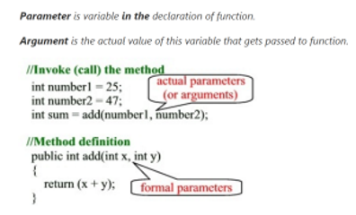

# [C# History](https://docs.microsoft.com/en-us/dotnet/csharp/whats-new/csharp-version-history#c-version-50)

## C# 1.0 (2002)

- Managed Code
- IDE - Visual Studio .NET 2002, 2003
- .NET Framework - 1.0, 1.1

- Classes
- Structs
- Interfaces
- Events
- Properties
- Delegates
- Expressions
- Statements
- Attributes

## C# 2.0 (2005)

- .Net Framework - 2.0

- **Generics**
- Partial types
- **Anonymous methods**
- Nullable value types
- **Iterators**
- Covariance and contravariance

- Indexer Accessors

- Getter/setter separate accessibility (Asymmetric Property)
- Method group conversions (delegates)
- Static classes
- Delegate inference

## C# 3.0 (2007) VS 2008, .Net FW 3.5

- IDE - Visual Studio 2008
- .Net Framework - 3.5

- Auto-implemented properties
- **Anonymous types**
- Query expressions (**LINQ**)
- **Lambda expressions**
- Expression trees
- **Extension methods**
- Expression Tree
- Implicitly typed local variables (var)
- Partial methods
- Object and collection initializers

## C# 4.0 () VS2010

- IDE - Visual Studio 2010
- .Net Framework - 4.0

- Dynamic binding
- Named/optional arguments
- Generic Covariant and Contravariant
- Embedded interop types (COM Interop)

## C# 5.0 ()VS2012

- IDE - Visual Studio 2012, 2013
- .Net Framework - 4.5, 4.5.1

- **Asynchronous members**
- Caller info attributes

## C# 6.0 () VS2015

- IDE - Visual Studio 2015
- .Net Framework - 4.6

- Auto-property initializers
- Primary Constructors
- Dictionary Initializer
- Declaration Expressions
- Expression bodied members
- Static imports [Static Using]
- Exception filters
- Null propagator [Null-Conditional Operator]
- String interpolation ($"")
- nameof() operator
- Index initializers

- Await in catch/finally blocks
- Default values for getter-only properties

## C# 7.0 ()VS2017

- IDE - Visual Studio 2017

- Digit Separators
- Ref locals and returns
- Out variables
- Tuples and deconstruction
- Pattern matching
- Local functions
- Expanded expression bodied members
- Other features included:
- Discards
- Binary Literals and Digit Separators
- Throw expressions

## C# 8.0 () VS2019

- Readonly members
- Default interface methods
- Pattern matching enhancements
- Switch expressions
- Property patterns
- Tuple patterns
- Positional patterns
- Using declarations
- Static local functions
- Disposable ref structs
- Nullable reference types
- Asynchronous streams
- Indices and ranges
- Null-coalescing assignment
- Unmanaged constructed types
- Stackalloc in nested expressions
- Enhancement of interpolated verbatim strings

## C# Killer Features

### Generics (C# 2.0)

### Extension Method (C# 3.0)

### Lambda expression (C# 3.0)

### LINQ (C# 3.0) VS2008, .Net 3.5

### Task (2010)VS2010 .Net 4.0

### Async/Await (C# 5.0) .Net 4.5

### Reactive Extension

Parameter vs Argument
----

- A picture is worth a thousand words



What is The "Type" Class?
----

- To avoid confusions:

    + Use "Type" to refer to the "Type" Class or instances of it.

    + Use "type" to refer to an actual "type", such as String, int, string[], etc.

- An instance of "Type" has metadata about a given "type"---such as String, int, string[], etc. or instances of a "type".

- Two ways to get a "type's" "Type":

    + typeof() operator

        ```csharp
        var intType = typeof(int); // takes an actual type as its argument.
        ```
    + GetType() method --- came from the Object class

        ```csharp
        var intType = 12.GetType(); // calls an instance's GetType() method
        var intType = "aString".GetType(); // calls an instance's GetType() method, no argument passed.
        ```

What is the Usage of "Type"?
----

- Get tons of information about a "type"
- Once you get a hold of a "type's" "Type", you can find out a lot about the "type"---is it an array, what are its Properties, what is its Name, etc.
- Examples:

```csharp
var emp = new Employee();
var empType = emp.GetType();

var inWhichAssembly = empType.AssemblyQualifiedName;
var whatIsItsFullName = empType.FullName;
var isItValueType = empType.IsValueType;
var whatIsItsName = empType.Name
var whatIsItsNamespace = empType.Namespace;
var propertyInfos = empType.GetProperties();    // an array of PropertyInfo[]
    ...

```

Why all the Lambdas (like @Html.DisplayNameFor(Expression<TDeletegate>))
----

- [why](https://odetocode.com/blogs/scott/archive/2012/11/26/why-all-the-lambdas.aspx "Why all the Lambdas")

- [LINQ - Lambda Expression - Expression<T>](https://odetocode.com/articles/738.aspx)


Generics
----

- C# Generics can be applied to 

    + Interface
    + Abstract class
    + Class
    + Method
    + Static method
    + Property
    + Event
    + Delegates
    + Operator

- Generics enable us to work with type-safe collections and classes and methods that can accept a **type parameter**. 

- We can take advantage of generics to eliminate:
    + redundant code
    + enforce type safety, 
    + promote code re-usability and maintainability. 


Static Reflection
----

- [Introduction to Static Reflection](http://www.jagregory.com/writings/introduction-to-static-reflection/)

- [Using Static Reflection to Get Property and Method names](http://joelabrahamsson.com/getting-property-and-method-names-using-static-reflection-in-c/)