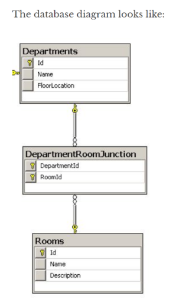
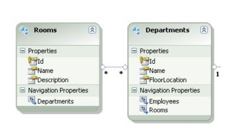

# LINQ

What is LINQ?
----

- **L**anguage **IN**tegrated **Q**uery

- a Feature introduced in .Net Framework 3.5 in 2007

- provides a language syntax that allows business-level programmers to query sets of data, without need to use SQL.

- Data:
    1. C# Objects
    2. C# Collections
    3. Data stored in SQL

Structure of a LINQ Query
----

- LINQ queries work by specifying 3 things:

    1. Where is the source data? (**FROM**)
    2. Of that source data, do I want any specific data? (**WHERE**)
    3. Which aspects of the data do I want to return? (**SELECT**)

```csharp
public class StoreEmployee
{
    public int ID { get; set; }
    public string LastName { get; set; }
    public string JobTitle { get; set; }
    public DateTime BirthDate { get; set; }
}


List<StoreEmployee> members = new List<StoreEmployee>() {
    new StoreEmployee() {LastName = "Jefferson", BirthDate = new DateTime(1955,9,25), JobTitle = "Store Manager", ID = 1},
    new StoreEmployee() {LastName = "Levinson", BirthDate = new DateTime(1992,3,1), JobTitle = "Produce Manager", ID = 2},
    new StoreEmployee() {LastName = "Gonzalez", BirthDate = new DateTime(1989,1,15), JobTitle = "Cashier", ID = 3},
    new StoreEmployee() {LastName = "Severin", BirthDate = new DateTime(1977,4,28), JobTitle = "Deli Manager", ID = 4},
    new StoreEmployee() {LastName = "Ishikawa", BirthDate = new DateTime(1983,10,1), JobTitle = "Public Relations Specialist", ID = 5},
    new StoreEmployee() {LastName = "Jones", BirthDate = new DateTime(1960,11,1), JobTitle = "Quality Control Specialist", ID = 6},
    new StoreEmployee() {LastName = "Goldman", BirthDate = new DateTime(1997,1,1), JobTitle = "Cashier", ID = 7},
    new StoreEmployee() {LastName = "Salas", BirthDate = new DateTime(1997,5,31), JobTitle = "Lead Cashier", ID = 8}
};

// young employees
var younguns = from m in members
               where m.BirthDate > new DateTime(1980, 1, 1)
               select m;

// young managers
var youngManagers = from m in members
                    where m.BirthDate > new DateTime(1980, 1, 1) && 
                          m.JobTitle.Contains("Manager")
                    select m;
```

Ordering
----

```csharp
var orderedYoungManagers = 
        from m in members
        where m.BirthDate < new DateTime(2010, 1, 1) &&
              m.JobTitle.Contains("Manager")
        orderby m.BirthDate
        select m;

var descendingYoungManagers = 
        from m in members
        where m.BirthDate < new DateTime(2010, 1, 1) &&
              m.JobTitle.Contains("Manager")
        orderby m.BirthDate descending
        select m;

var complexOrderedManagers = 
        from m in members
        where m.BirthDate < new DateTime(2010, 1, 1) &&
              m.JobTitle.Contains("Manager")
        orderby m.BirthDate descending, m.LastName  // multiple fields
        select m;
```

Projections
----

- We can just get the selected properties of an object that we want, using an anonymous type.

```csharp
var namesOnlyYounguns = 
        from m in members
        where m.BirthDate > new DateTime(1980, 1, 1)
        select new { m.FirstName, m.LastName };

// we can still iterate over the anonymous type
foreach(var name in namesOnlyYounguns)
{
    Console.WriteLine($"Name: {name.FirstName} {name.LastName}");
}
```

LINQ-to-Entities
----

- keep in mind, LINQ queries are **lazy**, execution is deferred until the query is iterated or ToList(), etc.

```csharp
using (NorthwindEntities context = new NorthwindEntities())
{
    var customers =
        from c in context.Customers
        where c.ContactName.Contains("Mar")
        orderby c.City, c.Country
        select c;
}
```

Aggregates
----

```csharp
using(NorthwindEntities context = new NorthwindEntities())
{
    var products = from p in context.Products
                   where p.UnitPrice < price
                   select p;
}
```

- to know if we get any products back, we can use **Any**

```csharp
var hasProducts = products.Any();
```

- More:

```csharp
var totalPrice = products.Sum(x => x.UnitPrice); //Sum the UnitPrice

var totalProducts = products.Count(); //Total number of products 

var totalProductsWhere = products.Count(x => x.UnitPrice < price); //Total number of products where the unit price is greater than some comparison price

var maxPrice = products.Max(x => x.UnitPrice); //The maximum unit price in the set
```

Query vs Method Syntax
----

- has two syntaxes
- can use either syntax
- but some operations are easier in one syntax than another
- like **joins** and **group by** are much easier (and more readable) in query syntax than method syntax.

Joins - [Join Operations](https://docs.microsoft.com/en-us/dotnet/csharp/programming-guide/concepts/linq/join-operations "Join Operations - MSFT")
----

- Join implements an inner join
- GroupJoin method has no direct equivalent in relational database, but it implements a superset of inner joins and left outer joins.
- Only equijoin in LINQ?

- Then, there is that **Group By**

|method syntax|description|query syntax|
|--|--|--|
|Join|Joins two seqs based on key selector functions and extract pairs of values| join...in ....on ... equals|
|GroupJoin|Joins two seqs based on key selector functions, and then groups the resulting matches for each element| join ... in ... on ... equals...into...|
|GroupBy| Grouping |group ... by ... into ... |

```csharp
using(NorthwindEntities context = new NorthwindEntities())
{
    string[] categoryNames = new string[]{  
                                    "Beverages",
                                    "Condiments",
                                    "Vegetables",
                                    "Dairy Products",
                                    "Seafood"
                                };
}
```

Cross Join (no "ON" clause)
----

```csharp
var crossjoinproducts =
        from c in categoryNames
        join p in context.Products
        select new { Category = c, p.ProductName };
```

- A **cross join** is the result of combining every item from Set A with every items from Set B. **Cross Join** is also called **Cartesian Product**, useful for generating test data.

Inner Join
----

```csharp
var products = 
        from c in categoryNames
        JOIN p in context.Products
        ON c equals p.Category.CategoryName // Inner Join
        select new { Category = c, p.ProductName };

```

Inner Join in Method Syntax
----

```csharp

var products =
        categoryNames.Join(
            inner: context.Products,
            outerSelector: categoryName => categoryName,
            innerSelector: product => product.CategoryName,
            resultSelector: (categoryName, product) => new {Category = categoryName, product},
            comparer: StringComparer.InvariantCultureIgnoreCase);
        );
```

- Note: product is NOT a IEnumerable

Group Join
----

```csharp
var categories =
        from c in categoryNames
        JOIN p in context.Products
        ON c equals p.Category.CategoryName INTO ps //Group Join
        select new { Category = c, Products = ps };
```

Group Join in Method syntax
----

```C#
var categoriesMethod =
        categoryNames.GroupJoin(
            inner: context.Products,
            outerSelector: c => c,
            innerSelector: p => p.Category.CategoryName,
            (c, ps) => new { Category = c, Products = ps }
        );
```

- Note: ps is a IEnumerable!

Left Join
----

```csharp
var leftOuterJoin = 
        from c in context.Categories
        JOIN p in context.Products 
        ON c equals p.Category INTO ps
        from p in ps.DefaultIfEmpty()
        select new 
                {
                    Category = c,
                    ProductName = p == null ? "(No products)" : p.ProductName
                };
```

Full Join
---

- Hahaha, there is no direct LINQ equivalent to SQL's Full JOIN!!
- Solution is do a left-outer-join, right-outer-join (a left-outer-join in reverse), and then do a union on two join results

```csharp
var leftOuterJoin =
    from first in firstNames
    join last in lastNames on first.ID equals last.ID into temp
    from last in temp.DefaultIfEmpty()
    select new
    {
        first.ID,
        FirstName = first.Name,
        LastName = last?.Name,
    };
var rightOuterJoin =
    from last in lastNames
    join first in firstNames on last.ID equals first.ID into temp
    from first in temp.DefaultIfEmpty()
    select new
    {
        last.ID,
        FirstName = first?.Name,
        LastName = last.Name,
    };
var fullOuterJoin = leftOuterJoin.Union(rightOuterJoin);

```

Grouping
----

- To find out products in each category

```csharp
var groupedProducts = 
        from p in context.Products
        GROUP p BY p.CategoryName INTO g
        select new { // an outer collection contains an inner collection
            Category = g.Key, // each item in outer collection has a key 
            Products = g // the inner collection
        };

```

- the Result of the query is a list of Categories, each of which has a collection of Products associated to them.

- we can iterate over the result and print each category/products:

```csharp
foreach (var category in groupedProducts)
{
    foreach (var product in category.Products)
    {
        Console.WriteLine(category.Category + ": " + product.ProductName);
    }
}
```

Grouping in Method Syntax
----

```csharp
var groupedProducts = 
        context.Products.GroupBy(
            keySelector: product => product.CategoryName,
            elementSelector: product => product,
            comparer: StringComparer.InvariantCultureIgnoreCase
        );

```

- Another GroupBy overload introduces a version of resultSelector which allows us to project each of our groups to new, chosen objects. The resultSelector take two parameters: key and grouped collection (type of IEnumerable).

```csharp
var resultSelectorGroupByResults = 
        context.Products.GroupBy(
            keySelector: product => product.CategoryName,
            resultSelector: (key, products) => new { Category = key, products.Select(prod=>prod.Name)},
            comparer: StringComparer.InvariantCultureIgnoreCase
        );
```

Join Many-to-Many relationship (EF)
----

- Database Diagram



```sql

// SQL (need to join with the association table)

SELECT 
      Departments.*, Rooms.*
FROM  Departments 
INNER JOIN DepartmentRoomJunction ON Departments.Id = DepartmentRoomJunction.DepartmentId
INNER JOIN Rooms ON DepartmentRoomJunction.RoomId = Rooms.Id
WHERE Departments.Id = 2

// LINQ (no need to do join with the association table)

var _departments = 
        from d in _context.Departments
        from r in _context.Rooms
        where d.Id == 2
        select d;
```

- In Entity Framework, many-to-many relationship are automatically joined!!!!
- So, there is no need to join them again in the query. 
- From Entity data model designer, we can see both Departments and Rooms are not connected with a junction table, as it would with the database diagram.



Skip and Take
----

```csharp
var first50 = groupedProducts.Take(50); // get first 50
var next50 = groupedProducts.Skip(50).Take(50); // get 51-100
```

Working with Collection
----

```c#
var categories = from c in context.Categories
                 where c.CategoryID > 3
                 select c;

var firstCategory = categories.First();

var firstCategoryMatched = categories.First(x => x.CategoryName == "Produce");

var firstCategoryDefault = categories.FirstOrDefault(x => x.CategoryName == "Nuts"); //returns null

var singleCategoryMatched = categories.Single(x => x.CategoryName == "Produce");
```

Non-EquiJoin
----

- The Problem Statement:
    + In a query expression, the join clause is limited to, and optimized for, equijoins, which are by far the most common type of join operation. 
    + When performing an equijoin, you will probably always get the best performance by using the join clause.

    + **However, the join clause cannot be used in the following cases:

        1. When the join is predicated on an expression of inequality (a non-equijoin).

        2. When the join is predicated on more than one expression of equality or inequality.

        3. When you have to introduce a temporary range variable for the right side (inner) sequence before the join operation.

- Solution

    + To perform joins that aren't equijoins, you can use multiple from clauses to introduce each data source independently. 
    
    + You then apply a predicate expression in a where clause to the range variable for each source. 
    
    + The expression also can take the form of a method call.

- Example

```csharp

var nonEquijoinQuery =
        from p in products
        LET catIds = from c in categories           // let
                     select c.ID
        where catIds.Contains(p.CategoryID) == true // predicate
        select new {
            Product = p.Name,
            CategoryID = p.CategoryID
        };

Console.WriteLine("Non-equijoin query:");
foreach (var v in nonEquijoinQuery)
{
    Console.WriteLine($"{v.CategoryID,-5}{v.Product}");
}
```

- Would a outer left join with "... where category = null" would work in SQL?

```sql
select p.Name, c.ID
from dbCtx.products p
LEFT JOIN dbCtx.categories c
ON c.ID = p.CategoryID
where c.ID is NULL
```

- Another Example

```csharp
string[] names = System.IO.File.ReadAllLines(@"../../../names.csv");
string[] scores = System.IO.File.ReadAllLines(@"../../../scores.csv");

// Merge the data sources using a named type.
// You could use var instead of an explicit type for the query.
IEnumerable<Student> queryNamesScores =
    // Split each line in the data files into an array of strings.
    from name in names
    let x = name.Split(',')
    from score in scores
    let s = score.Split(',')
    where x[2] == s[0] // Look for matching IDs from the two data files.
    select new Student() // If the IDs match, build a Student object.
    {
        FirstName = x[0],
        LastName = x[1],
        ID = Convert.ToInt32(x[2]),
        ExamScores = (from scoreAsText in s.Skip(1)
                      select Convert.ToInt32(scoreAsText)).
                      ToList()  // must realize it now to create the Student instance
    };

// Optional. Store the newly created student objects in memory
// for faster access in future queries
List<Student> students = queryNamesScores.ToList();

foreach (var student in students)
{
    Console.WriteLine($"The average score of {student.FirstName} {student.LastName} is {student.ExamScores.Average()}.");
}
```

The Let Clause
----

- **let** keyword creats a new range variable and initialize it with the result of the expression you supply. Once initialized with a value, the range variable cannot be used to store another value. If the range variable holds a queryable type, it can be queried.

```csharp
string[] strings = {
                        "A penny saved is a penny earned.",
                        "The early bird catches the worm.",
                        "The pen is mightier than the sword."
                   };

// Split the sentence into an array of words
// and select those whose first letter is a vowel.
var earlyBirdQuery =
    from sentence in strings
    let words = sentence.Split(' ') // split the sentence, words is a IEnumerable

    from word in words
    let w = word.ToLower()          // convert the word in words to lower case

    where w[0] == 'a' || w[0] == 'e' ||
          w[0] == 'i' || w[0] == 'o' || w[0] == 'u'

    select word;

// Execute the query.
foreach (var v in earlyBirdQuery)
{
    Console.WriteLine("\"{0}\" starts with a vowel", v);
}

```

Set Operations
----

- Data

```csharp
var productsFirstLetters =
        (from p in context.Products
        select p.ProductName).ToList().Select(x => x[0]);

var customersFirstLetters =
        (from c in context.Customers
        select c.CompanyName).ToList().Select(x => x[0]);
```

- Then

```csharp
var unionLetters = productsFirstLetters.Union(customersFirstLetters).OrderBy(x => x);

var intersectLetters = productsFirstLetters.Intersect(customersFirstLetters).OrderBy(x => x);

var exceptLetters = productsFirstLetters.Except(customersFirstLetters).OrderBy(x => x);
```

- **UNION** is used to return the items that exist in either sets.
- **INTERNET** is used to return items that exist in both sets.
- **EXCEPT** is used to return items that does not exist in another set.