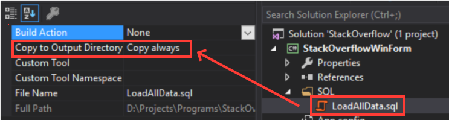
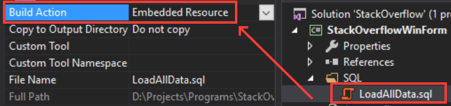

C# -Sundries
===

Long Query
---

- If not using Stored Procedures, and is prefer to keep the SQL close to the C# code, then two OPTIONs:

1. Text file copied alongside executable in a sub-folder



```csharp
    // The way to access the resource

    private String LoadSqlContent()
    {
        String fileName = "Sql\\LoadAllData.sql";

        if (!File.Exists(fileName))
        {
            String errMsg = String.Format($"File {filename} does not exist or access is denied");
            throw new FileNotFoundException(errMsg, fileName);
        }

        String fileContent = String.Empty;
        using (StreamReader sr = File.OpenText(fileName))
        {
            fileContent = sr.ReadToEnd();
        }

        return fileContent;
    }
```

2. Use Assembly's Embedded Resource



```csharp
    private String LoadAssemblyResource()
    {
        Assembly assembly = Assembly.GetExecutingAssembly();
        String fileName = "<...>.SQL.LoadAllData.sql";

        // Handy bit of debug code to list all the resource names in case there
        // is an issue trying to find/load a resource
        String[] resourceNames = assembly.GetManifestResourceNames();

        String fileContent = String.Empty;
        using (Stream stream = assembly.GetManifestResourceStream(fileName))
        {
            if (stream == null)
            {
                String errorMessage = String.Format("Resource File '{0}' does not exist", fileName);
                throw new MissingManifestResourceException(errorMessage);
            }

            using (StreamReader reader = new StreamReader(stream))
            {
                fileContent = reader.ReadToEnd();
            }
        }

        return fileContent;
    }
```

Ways (Best) to get Application Folder Path
---

- Application.StartupPath
- System.IO.Path.GetDirectory(Application.ExecutablePath)

> Only works for WinForm Applications

- System.IO.Path.GetDirectoryName(System.Reflection.Assembly.GetExecutingAssembly().Location)

- AppDomain.CurrentDomain.BaseDirectory

> Useful for Web Application; will return something like "C:\\hg\\Services\\Services\\Services.Website\\" which is base directory.

- System.IO.Directory.GetCurrentDirectory()
- Environment.CurrentDirectory

> Return location of where the process got fired from - so for Web Application in Debug mode from Visual Studio would be like "C:\\Program Files (x86)\\IIS Express"

- System.IO.Path.GetDirectoryName(System.Reflection.Assembly.GetExecutingAssembly().GetName().CodeBase)

> Return the location where .DLL is running the code; for Web Application, it will be  "file:\\C:\\hg\\Services\\Services\\Services.Website\\bin"

- HttpContext.Current.Server.MapPath();
- System.Web.Hosting.HostingEnvironment.ApplicationPhysicalPath;

> For Web Application, return the current root directory, generally called by Web Page for current incoming request.

```sql
string path1 = System.IO.Path.GetDirectoryName(System.Reflection.Assembly.GetExecutingAssembly().Location);
string path2 = System.Web.Hosting.HostingEnvironment.ApplicationPhysicalPath;
string path3 = this.Server.MapPath("");

//path1 = C:\Windows\Microsoft.NET\Framework64\v4.0.30319\Temporary ASP.NET Files\root\a897dd66\ec73ff95\assembly\34543543 - 435 - 345 - 35345 - 435 - 435
//path2 = C:\inetpub\wwwroot\ABC.WCF.Services
//path3 = C:\inetpub\wwwroot\ABC.WCF.Services
```

[Ref](https://www.asptricks.net/2015/06/application-current-folder-in-aspnet-c.html)


String.Format
---

```csharp
[TestMethod]
public void BraceEscapingTest()
{
    // double {{ or }} to escape  { or }
    var result = String.Format("Foo {{0}}", "1,2,3");  //"1,2,3" is not parsed
    Assert.AreEqual("Foo {0}", result);

    result = String.Format("Foo {{{0}}}", "1,2,3");
    Assert.AreEqual("Foo {1,2,3}", result);

    result = String.Format("Foo {0} {{bar}}", "1,2,3");
    Assert.AreEqual("Foo 1,2,3 {bar}", result);

    result = String.Format("{{{0:N}}}", 24); //24 is not parsed
    Assert.AreEqual("{N}", result);

    result = String.Format("{0}{1:N}{2}", "{", 24, "}");
    Assert.AreEqual("{24.00}", result);

    result = String.Format("{{{0}}}", 24.ToString("N"));
    Assert.AreEqual("{24.00}", result);
}
```

- Using C# 6.0's String Interpolation

```csharp

// Escaping Brackets: String Interpolation $(""). it is new feature in C# 6.0
var inVal = "1, 2, 3";
var outVal = $" foo {{{inVal}}}";
//Output will be:  foo {1, 2, 3}
```

[String.Format Q&A](https://docs.microsoft.com/en-us/dotnet/api/system.string.format?redirectedfrom=MSDN&view=netcore-3.1#QA)

[Ref](https://stackoverflow.com/questions/91362/how-to-escape-braces-curly-brackets-in-a-format-string-in-net)
