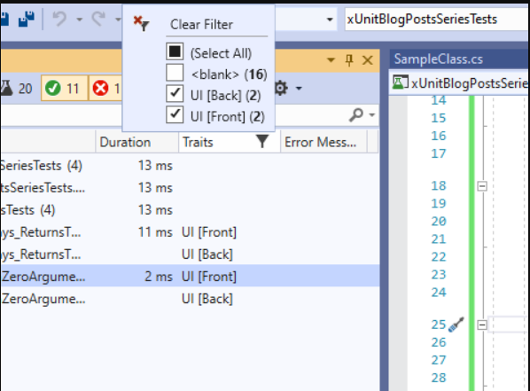
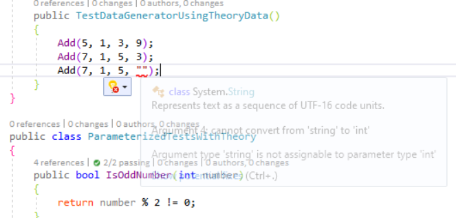

xUnit CheatSheet
====

[TOC]

Types of Tests
----

1. Unit Test - Mocking the dependencies, and focus on the unit of work at hand. Least of cost to do testing.
2. Integration Test - Taking dependencies into account. More expensive and more involved than Unit Test, less frequently done.
3. End-to-End, or Functional UI, Test - Tests from the user's perspective, so the whole system is being tested. This is the ultimate tests normally done by testers/QA team. 

xUnit Setup - for Unit Tests
----

- Normally, we have the code to be tested in a library project.

- To test the code, create a xUnit project and have following packages installed.
  - xunit
  - xunit.runner.visualstudio

- Note: Visual Studio already have an xUnit project template. Using it, those needed xUnit packages are included, so we don't need to manually add them.

Other Packages for Unit Test  
----

- For Mocking: Moq, FakeitEasy, NSubstitute
- For Assertion: FluentAssertions
- Data Driven: AutoFixture

Naming Unit Tests
----

- Things to consider
- Name of the Class being Tested
- Method being Tested
- Condition being Tested
- Expectation of the test
- eg:

```
HomeController_Index_Always_ReturnCorrectType(...)
     ^           ^     ^         ^
     |           |     |         |---expected
     |           |     |---condition
     |           |---method
     |---class
```

What to Test
----

- Only for those worthy of creating a test; complex logics.

- Skip those trivial code

- Unit Test or Integration Test

xUnit - Test Method Structure
----

1. Arrange
2. Act
3. Assert

xUnit - Asserts
----

1. Value Assertion - asserting over a value
2. Type or Type Reference Assertion
3. Action Assertion

- Value Asserts

```csharp
public void xUnit_Value_Assertion()
{
    // -- Contains/DoesNotContain

    // public static void Contains(string expectedSubstring, string actualString);
    Assert.Contains("text", "This is a text.");

    // public static void Contains<T>(IEnumerable<T> collection, Predicate<T> filter);
    var names = new List<string> { "Picard", "Kirk" };
    Assert.Contains(names, n => n == "Kirk");

    // public static void DoesNotContain(string expectedSubstring, string actualString);
    Assert.DoesNotContain("sdf", "This is a text.");

    // -- True/False
    Assert.True("".GetType() == typeof(string));
    Assert.False(1.GetType() == typeof(int));

    // -- Matches/DoesNotMatch

    // public static void Matches(string expectedRegexPattern, string actualString);
    // public static void DoesNotMatch(string expectedRegexPattern, string actualString);
    var regEx = @"\A[A-Z0-9+_.-]+@[A-Z0-9.-]+\Z";
    Assert.Matches(regEx, "this is a text");
    Assert.DoesNotMatch(regEx, "this is a text");

    // -- StartsWith/EndsWith

    // public static void StartsWith(string expectedStartString, string actualString);
    // public static void EndsWith(string expectedEndString, string actualString);
    Assert.StartsWith("This is a text.", "This");
    Assert.EndsWith("This is a text.", "text.");

    // -- Set

    var set1 = new HashSet<int> { 1, 2, 3, 4, 5, 6 };
    var set2 = new HashSet<int> { 3, 4 };
    var notProperSubset = new HashSet<int> { 1, 2, 3, 4, 5, 6 };

    // public static void Subset<T>(ISet<T> expectedSuperset, ISet<T> actual);
    Assert.Subset(set1, set2);

    // public static void ProperSubset<T>(ISet<T> expectedSuperset, ISet<T> actual);
    Assert.ProperSubset(set1, set2);

    // public static void ProperSubset<T>(ISet<T> expectedSuperset, ISet<T> actual);
    // fails, https://mathinsight.org/definition/proper_subset
    Assert.ProperSubset(set1, notProperSubset);

    var set3 = new HashSet<int> { 1, 2, 3, 4, 5, 6 };
    var set4 = new HashSet<int> { 3, 4 };
    var notProperSuperSet = new HashSet<int> { 1, 2, 3, 4, 5, 6 };

    // public static void Superset<T>(ISet<T> expectedSubset, ISet<T> actual);
    Assert.Superset(set4, set3);
    // public static void ProperSuperset<T>(ISet<T> expectedSubset, ISet<T> actual);
    Assert.ProperSuperset(set4, notProperSuperSet);

    // public static void ProperSuperset<T>(ISet<T> expectedSubset, ISet<T> actual);
    // fails
    Assert.ProperSuperset(set3, notProperSuperSet);

    // -- Others

    // public static void Equal(string expected, string actual);
    Assert.Equal("text", "Text");
    // public static void NotEqual<T>(T expected, T actual);
    Assert.NotEqual("text", "Text");

    // public static void Empty(IEnumerable collection);
    Assert.Empty(new List<int> { });
    // public static void NotEmpty(IEnumerable collection);
    Assert.NotEmpty(new List<int> { 1 });

    // public static void InRange<T>(T actual, T low, T high) where T : IComparable;
    Assert.InRange(3, 1, 6);

    // public static void NotInRange<T>(T actual, T low, T high) where T : IComparable;
    Assert.NotInRange(3, 1, 2);

    // public static T Single<T>(IEnumerable<T> collection);
    var listWithSingle = new List<int> { 1 };
    Assert.Single(listWithSingle);
}
```

- Type, Type Reference Assertion

```csharp

public void xUnit_Type_Reference_Assertion()
{
    // public static T IsType<T>(object @object);
    Assert.IsType<string>("passes");

    // public static void IsNotType<T>(object @object);
    Assert.IsNotType<string>(1);
    Assert.IsNotType<string>("fails");

    // public static T IsAssignableFrom<T>(object @object);
    Assert.IsAssignableFrom<IEnumerable<int>>(new List<int>());
    Assert.IsAssignableFrom<IDictionary<int, string>>(new List<int>());

    // public static void Null(object @object);
    Assert.Null(null);

    // public static void NotNull(object @object);
    Assert.NotNull(new List<int>());

    var obj1 = new object();
    var obj2 = obj1;
    var obj3 = new object();

    // public static void Same(object expected, object actual);
    Assert.Same(obj1, obj2);

    // public static void NotSame(object expected, object actual);
    Assert.NotSame(obj1, obj3);

    //Assert.ReferenceEquals(obj1, obj2); // Deprecated
    // It's better to call Assert.Same() instead.
    Assert.Same(obj1, obj2);

    /* 
    Strictly relies on the built-in behavior of val1.Equals(val2),
    since Assert.Equal attempts to do a lot of reconciliation to get
    the correct answer for collections, etc.
    */
    // public static void StrictEqual<T>(T expected, T actual);
    Assert.StrictEqual(1, 1);

    // public static void NotStrictEqual<T>(T expected, T actual);
    Assert.NotStrictEqual(1, 1);
}
```

- Tests Without An Assert

  - A method decorated with [Fact] and it does not throw any exception, then that test method passes.

- Event-based Assertion

  - To check if an event is raised or an exception is thrown

- Asserting if An Event is Raised

```csharp
 public class MessageEventArgs : EventArgs
{
    public string Message { get; set; }
}

[Fact]
public async Task xUnit_Event_Assertion()
{
    var messageSender = new Message();

    var receivedEvent = 
        // public static RaisedEvent<T> Raises<T>(
        //      Action<EventHandler<T>> attach, 
        //      Action<EventHandler<T>> detach, 
        //      Action testCode) where T : EventArgs;
        Assert.Raises<MessageEventArgs>(
                a => messageSender.SendMessageEvent += a,
                a => messageSender.SendMessageEvent -= a,
                () => messageSender.SendMessageToUser("This is an event message"));

    Assert.NotNull(receivedEvent);
    Assert.Equal("This is an event message", receivedEvent.Arguments.Message);

    var receivedEvent2 = 
        // public static RaisedEvent<T> RaisesAny<T>(
        //      Action<EventHandler<T>> attach, 
        //      Action<EventHandler<T>> detach, 
        //      Action testCode) where T : EventArgs;
        Assert.RaisesAny<MessageEventArgs>(
            a => messageSender.SendMessageEvent += a,
            a => messageSender.SendMessageEvent -= a,
            () => messageSender.SendMessageToUser("This is an event message"));

    Assert.NotNull(receivedEvent2);
    Assert.Equal("This is an event message", receivedEvent2.Arguments.Message);

    var receivedEventTask = 
        // [AsyncStateMachine(typeof(Assert.<RaisesAsync>d__48<>))]
        // public static Task<RaisedEvent<T>> RaisesAsync<T>(
        //      Action<EventHandler<T>> attach, 
        //      Action<EventHandler<T>> detach, Func<Task> testCode) where T : EventArgs;
        Assert.RaisesAsync<MessageEventArgs>(
            a => messageSender.SendMessageEvent += a,
            a => messageSender.SendMessageEvent -= a,
            async () => messageSender.SendMessageToUser("This is an event message"));

    var receivedEventAsync = await receivedEventTask;

    Assert.NotNull(receivedEventAsync);
    Assert.Equal("This is an event message", receivedEventAsync.Arguments.Message);
}

```

- Assertions Related to Exception

```csharp
public class Buggy
{
    public void ThrowsInvalidCastException() { throw new InvalidCastException(); }
    public void ThrowsCustomInvalidOperationException() { throw new CustomInvalidOperationException(); } 
    public Task ThrowsExceptionAsync() { throw new InvalidCastException(); }
}
public class CustomInvalidOperationException : InvalidOperationException { }

[Fact]
public void ThrowsException_Assertions()
{
    var exceptionThrower = new Buggy();

    // public static T Throws<T>(Action testCode) where T : Exception;
    Assert.Throws<InvalidCastException>(exceptionThrower.ThrowsInvalidCastException);

    // public static T ThrowsAny<T>(Action testCode) where T : Exception;
    Assert.ThrowsAny<CustomInvalidOperationException>(exceptionThrower.ThrowsCustomInvalidOperationException);
}

[Fact]
public void ThrowsException_AssertionsAsync()
{
    var exceptionThrower = new Buggy();
    Func<Task> ThrowExceptionFunc = () => exceptionThrower.ThrowsExceptionAsync();
    Assert.ThrowsAsync<InvalidCastException>(ThrowExceptionFunc);
    Assert.ThrowsAnyAsync<InvalidCastException>(ThrowExceptionFunc);
}

[Fact]
public void ThrowsException_AssertionsRecord()
{
    var exceptionThrower = new Buggy();
    Exception ex = Record.Exception(() => exceptionThrower.ThrowsInvalidCastException());
    Assert.NotNull(ex);
}

```

- Checking Changes in a Property or a Collection

```csharp
[Fact]
public void AllNumberIsEven()
{
    var numbers = new List<int> { 2, 4, 6 };

    Action<int> allAreEven = (a) => { Assert.True(a % 2 == 0); };

    // public static void All<T>(IEnumerable<T> collection, Action<T> action);
    Assert.All(numbers, allAreEven);
}

[Fact]
public void AllNumberAreEvenAndNotZero()
{
    var numbers = new List<int> { 2, 4, 6 };

    // public static void Collection<T>(IEnumerable<T> collection, params Action<T>[] elementInspectors);
    Assert.Collection(numbers, a => Assert.True(a == 2), a => Assert.True(a == 4), a => Assert.True(a == 6));

    // Assert.All(result, item => Assert.True(a % 2 == 0));
}

[Fact]
public void ShouldClearWithEvents()
{
    // arrange
    //var target = new ObservableStack<string>();
    var target = new ObservableCollection<string>();

    //target.Push("1");
    target.Add("1");

    // act
    // public static void PropertyChanged(
    //      INotifyPropertyChanged @object, 
    //      string propertyName, 
    //      Action testCode);
    Assert.PropertyChanged(target, "Count", () => target.Clear());

    // assert
    Assert.True(target.Count == 0);
}
```

- Using Fluent Assertion

```csharp
public void Fluent_Assertion()
{ 
    string actual = "ABCDEFGHI";
    actual.Should()
            .StartWith("AB")
            .And
            .EndWith("HI")
            .And
            .Contain("EF")
            .And
            .HaveLength(9);
}
```

xUnit - Parallelism and Collection Test
----

- If tests are group in collections, by default, these collections of tests are run in parallel. (Note: NUnit don't do test parallelism)

- Run Tests in Parallel with Test Collections

- In xUnit, by default every test class is consider as a collection and collections of test are ran in parallel. But, tests within an individual collection/class are not run in parallel.

```csharp
public class TestClass1
{
    [Fact]
    public void Test1()
    {
        Thread.Sleep(3000);
    }
}

public class TestClass2
{
    [Fact]
    public void Test2()
    {
        Thread.Sleep(5000);
    }
}
```

- Test1 and Test2 are ran in parallel, so the overall test will finish in 5 sec.

- [Collection] Attribute to combine collections/classes, so that they don't run in parallel

```csharp
[Collection("#1")]
public class TestClass1
{
    [Fact]
    public void Test1() { Thread.Sleep(3000); }
}

[Collection("#1")]
public class TestClass2
{
    [Fact]
    public void Test2() { Thread.Sleep(5000); }
}
```

xUnit - Share Test Context with IClassFixture and ICollectionFixture
----

- xUnit can share test context and dependencies between tests and between multiple test classes. 

- Can also choose to get a fresh set of data every time for a test

- Test Setup and Cleanup Codes, using Constructor() and Dispose()

  - We can use Constructor to do Cleanup is because for each xUnit test, its associated test class is instantiated. Test and Class instance is one to one

- Note: Very different from NUnit

```csharp
public class InMemoryDbContextTests : IDisposable
{
    InMemoryDbContext  inMemoryDbContext;

    // constructor
    public InMemoryDbContextTests()
    {
        inMemoryDbContext = new InMemoryDbContext();
    }

    public void Dispose()
    {
        inMemoryDbContext.Dispose();
    }

    [Fact]
    public void WithNoItems_CountShouldReturnZero()
    {
        var count = inMemoryDbContext.Users.Count();
        Assert.Equal(0, count);
    }

    [Fact]
    public void AfterAddingItem_CountShouldReturnOne()
    {
        inMemoryDbContext.Users.Add(new User());
        var count = inMemoryDbContext.Users.Count;
        Assert.Equal(1, count);
    }
}
```

- Using IClassFixture to Share Context in A **Single** Test Class, among tests of that Test Class
- [Ref](https://hamidmosalla.com/2018/07/21/share-expensive-object-between-tests-by-iclassfixture/)

```csharp
public class SharedInMemoryDbContextTests : IClassFixture<InMemoryDbContextFixture>
{
    InMemoryDbContextFixture fixture;

    public SharedInMemoryDbContextTests(InMemoryDbContextFixture fixture)
    {
        this.fixture = fixture;
    }

    [Fact]
    public void WithNoItems_CountShouldReturnZero()
    {
        var count = fixture.Context.Users.Count();
        Assert.Equal(0, count);
    }

    [Fact]
    public void AfterAddingItem_CountShouldReturnOne()
    {
        fixture.Context.Users.Add(new User());
        var count = fixture.Context.Users.Count;
        Assert.Equal(1, count);
    }

    // ...
}
```

- Using ICollectionFixture to Share Context in **Multiple** Test Classes
- [Ref](https://hamidmosalla.com/2020/01/26/xunit-part-4-parallelism-and-custom-test-collections/)

```csharp
[CollectionDefinition("Context collection")]
public class InMemoryDbContextFixtureCollection : ICollectionFixture<InMemoryDbContextFixture>
{
    // This class has no code, and is never created. Its purpose is simply
    // to be the place to apply [CollectionDefinition] and all the
    // ICollectionFixture<> interfaces.
}

[Collection("Context collection")]
public class ContextTestClass1
{
    InMemoryDbContextFixture fixture;

    public ContextTestClass1(InMemoryDbContextFixture fixture)
    {
        this.fixture = fixture;
    }
}

[Collection("Context collection")]
public class ContextTestClass2
{
    // ...
}

```

xUnit - Custom Attributes for Testing Database
----

- Creating SqlServerData Attribute

```csharp
/// <summary>
/// Provides a data source for a data theory, with the data coming a Microsoft 
/// SQL Server.
/// </summary>
[AttributeUsage(AttributeTargets.Method, AllowMultiple = true, Inherited = true)]
[SuppressMessage("Microsoft.Design", "CA1019:DefineAccessorsForAttributeArguments", Justification = "The values are available indirectly on the base class.")]
[SuppressMessage("Microsoft.Performance", "CA1813:AvoidUnsealedAttributes", Justification = "This attribute is designed as an extensibility point.")]
public class SqlServerDataAttribute : OleDbDataAttribute
{
    const string sqlWithTrust =
        "Provider=SQLOLEDB; Data Source={0}; Initial Catalog={1}; Integrated Security=SSPI;";

    const string sqlWithUser =
        "Provider=SQLOLEDB; Data Source={0}; Initial Catalog={1}; User ID={2}; Password={3};";

    /// <summary>
    /// Creates a new instance of <see cref="SqlServerDataAttribute"/>, using 
    /// a trusted connection.
    /// </summary>
    /// <param name="serverName">The server name of the Microsoft SQL Server</param>
    /// <param name="databaseName">The database name</param>
    /// <param name="selectStatement">The SQL SELECT statement to return the data for the data theory</param>
    public SqlServerDataAttribute(
        string serverName, string databaseName, string selectStatement)
        : base(String.Format(CultureInfo.InvariantCulture, sqlWithTrust, 
                             serverName, databaseName), selectStatement)
    {
    }

    /// <summary>
    /// Creates a new instance of <see cref="SqlServerDataAttribute"/>, using the provided username and password.
    /// </summary>
    /// <param name="serverName">The server name of the Microsoft SQL Server</param>
    /// <param name="databaseName">The database name</param>
    /// <param name="userName">The username for the server</param>
    /// <param name="password">The password for the server</param>
    /// <param name="selectStatement">The SQL SELECT statement to return the data for the data theory</param>
    public SqlServerDataAttribute(string serverName, string databaseName,
                                  string userName, string password,
                                  string selectStatement)
        : base(String.Format(CultureInfo.InvariantCulture, sqlWithUser, serverName, 
                             databaseName, userName, password), selectStatement)
    { }
}

```

- Using the SqlServerData Attribute

```csharp
// <summary>
/// Connects to a SQL Server database called TestDatabase (You will need to pass 
/// in your own database name)
/// </summary>
/// <param name="FirstName"></param>
/// <param name="LastName"></param>
[Theory]
[SqlServerData("(local)", "TestDatabase", "select FirstName, LastName from Users")]
public void SqlServerTests(string FirstName, string LastName)
{
    Assert.Equal("Peter Beardsley", String.Format("{0} {1}", FirstName, LastName));
}
```

- References
- [xUnit Database](https://hamidmosalla.com/2020/02/16/xunit-part-6-testing-the-database-with-xunit-custom-attributes/)
- [Test with Database](http://xunitpatterns.com/Testing%20With%20Databases.html)
- [Integration Test with xUnit](https://jimmybogard.com/integration-testing-with-xunit/)
- [Theory: InlineData, MemberData, ClassData](https://hamidmosalla.com/2017/02/25/xunit-theory-working-with-inlinedata-memberdata-classdata/)

xUnit - using Trait to Categorize Tests
----

- What is Trait?
- Categorize tests so that we can run particular tests belong to a category.

```csharp
[Fact]
[Trait("UI", "Front")]
public void Add_Always_ReturnsTheCorrectResult()
{
    Assert.True(_sut.Add(2, 2) == 4);
}

[Fact]
[Trait("UI", "Front")]
public void Add_WithZeroArguments_ReturnsZero()
{
    Assert.True(_sut.Add(0, 0) == 0);
}

[Fact]
[Trait("UI", "Back")]
public void Add_Always_ReturnsTheCorrectResult2()
{
    Assert.True(_sut.Add(2, 2) == 4);
}

[Fact]
[Trait("UI", "Back")]
public void Add_WithZeroArguments_ReturnsZero2()
{
    Assert.True(_sut.Add(0, 0) == 0);
}
```

- The **Trait** attribute has two arguments.
- First, the actual name of the category.
- Second, the subsection within the category



- Third Party Improved Trait - xUnit.Categories

- Running Test in Console Based on Trait [ref](https://docs.microsoft.com/en-us/dotnet/core/tools/dotnet-test)

```dotnetcli
dotnet test --filter "Category=UI&Category!=Integration"
```

xUnit - Using Theory, with InlineData, MemberData, ClassData
----

- There are two types of xUnit Unit Tests---[Fact] and [Theory]
- [Fact] when some criteria that always must be met, regardless of data.
- [Theory] depends on set of parameters and their data.

- InlineData, the simplest of providing data to [Theory]

```csharp
public class Test_Using_InlineData 
{
   public bool IsOddNumber(int number) { return number % 2 != 0; }

  [Theory]
  [InlineData(5, 1, 3, 9)] // <<< Data for Test Case 1
  [InlineData(7, 1, 5, 3)] // <<< Data for Test Case 2
  public void AllNumbers_AreOdd_WithInlineData(int a, int b, int c, int d)
  {
      Assert.True(IsOddNumber(a));
      Assert.True(IsOddNumber(b));
      Assert.True(IsOddNumber(c));
      Assert.True(IsOddNumber(d));
  }
}
```

- InlineData is simple to use, but the draw back is it can not handle complex data, like Class, or List, etc.

- ClassData and MemberData can handle complex data.

- ClassData, providing data to [Theory]

```csharp

// 1. TestData Generator Class
public class TestDataGenerator : IEnumerable<object[]>
{
    private readonly List<object[]> _data = new List<object[]>
    {
        new object[] {5, 1, 3, 9},
        new object[] {7, 1, 5, 3}
    };

    public IEnumerator<object[]> GetEnumerator() => _data.GetEnumerator();
    IEnumerator IEnumerable.GetEnumerator() => GetEnumerator();
}

// 2. Test Class
public class ParameterizedTests
{
    public bool IsOddNumber(int number) { return number % 2 != 0; }

    [Theory]
    [ClassData(typeof(TestDataGenerator))]
    public void AllNumbers_AreOdd_WithClassData(int a, int b, int c, int d)
    {
        Assert.True(IsOddNumber(a));
        Assert.True(IsOddNumber(b));
        Assert.True(IsOddNumber(c));
        Assert.True(IsOddNumber(d));
    }
}
```

- MemberData, providing data to [Theory]

```csharp
public class Person
{
    public string Name { get; set; }
    public int Age { get; set; }
}

public class TestDataGenerator : IEnumerable<object[]>
{
    public static IEnumerable<object[]> GetNumbers()
    {
        yield return new object[] { 5, 1, 3, 9 };
        yield return new object[] { 7, 1, 5, 3 };
    }

    public static IEnumerable<object[]> GetPerson()
    {
        yield return new object[]
        {
            new Person {Name = "Tribbiani", Age = 56},
            new Person {Name = "Gotti", Age = 16},
            new Person {Name = "Sopranos", Age = 15},
            new Person {Name = "Corleone", Age = 27}
        };

        yield return new object[]
        {
            new Person {Name = "Mancini", Age = 79},
            new Person {Name = "Vivaldi", Age = 16},
            new Person {Name = "Serpico", Age = 19},
            new Person {Name = "Salieri", Age = 20}
        };
    }
}

public class ParameterizedTests
{
    public bool IsOddNumber(int number) { return number % 2 != 0; }
    public bool IsAboveFourteen(Person person) { return person.Age > 14; }

    public static IEnumerable<object[]> GetNumbers()
    {
        yield return new object[] { 5, 1, 3, 9 };
        yield return new object[] { 7, 1, 5, 3 };
    }

    [Theory]
    [MemberData(nameof(GetNumbers))]
    public void AllNumbers_AreOdd_WithMemberData(int a, int b, int c, int d)
    {
        Assert.True(IsOddNumber(a));
        Assert.True(IsOddNumber(b));
        Assert.True(IsOddNumber(c));
        Assert.True(IsOddNumber(d));
    }

    [Theory]
    [MemberData(nameof(TestDataGenerator.GetNumbers), 
                MemberType = typeof(TestDataGenerator))]
    public void AllNumbers_AreOdd_WithMemberData_FromDataGenerator(
                                int a, int b, int c, int d)
    {
        Assert.True(IsOddNumber(a));
        Assert.True(IsOddNumber(b));
        Assert.True(IsOddNumber(c));
        Assert.True(IsOddNumber(d));
    }

    [Theory]
    [MemberData(nameof(TestDataGenerator.GetPerson), 
                MemberType = typeof(TestDataGenerator))]
    public void AllPersons_AreAbove14_WithMemberData_FromDataGenerator(
                    Person a, Person b, Person c, Person d)
    {
        Assert.True(IsAboveFourteen(a));
        Assert.True(IsAboveFourteen(b));
        Assert.True(IsAboveFourteen(c));
        Assert.True(IsAboveFourteen(d));
    }
}
```

- Drawbacks of ClassData and MemberData
  - Not Type-Safe

xUnit - Using Theory, with TheoryData; and Type-Safe
----

- TheoryData offers us Type-Safe

```C#
public class TestDataGeneratorUsingTheoryData : TheoryData<int, int, int, int>
{
    public TestDataGeneratorUsingTheoryData()
    {
        Add(5, 1, 3, 9);
        Add(7, 1, 5, 3);
    }
}

public class ParameterizedTestsWithTheoryData
{
    public bool IsOddNumber(int number) { return number % 2 != 0; }

    [Theory]
    [ClassData(typeof(TestDataGeneratorUsingTheoryData))]
    public void AllNumbers_AreOdd_WithTheoryData(int a, int b, int c, int d)
    {
        Assert.True(IsOddNumber(a));
        Assert.True(IsOddNumber(b));
        Assert.True(IsOddNumber(c));
        Assert.True(IsOddNumber(d));
    }
}
```



- Another Example

```csharp
public class ReplacingMemberDataUsingTheoryData
{
    public bool IsAboveFourteen(Person person) { return person.Age > 14; }

    public static TheoryData<Person> PersonData =>
                        new TheoryData<Person>
                        {
                            new Person {Name = "Tribbiani", Age = 56},
                            new Person {Name = "Gotti", Age = 16},
                            new Person {Name = "Sopranos", Age = 15},
                            new Person {Name = "Corleone", Age = 27},
                            new Person {Name = "Mancini", Age = 79},
                            new Person {Name = "Vivaldi", Age = 16},
                            new Person {Name = "Serpico", Age = 19},
                            new Person {Name = "Salieri", Age = 20}
                        };

    [Theory]
    [MemberData(nameof(PersonData), 
                MemberType = typeof(ReplacingMemberDataUsingTheoryData))]
    public void AllPersons_AreAbove14_WithTheoryData_FromDataGenerator(Person a)
    {
        Assert.True(IsAboveFourteen(a));
    }
}

```

Credit:

- [xUnit](https://hamidmosalla.com/2020/01/05/xunit-part-1-xunit-packages-and-writing-your-first-unit-test/)

- [xUnit Samples](https://github.com/HamidMosalla/xUnitBlogPostsSeries/tree/master/xUnitBlogPostsSeriesTests)

- [xUnit Configuration](https://xunit.net/docs/configuration-files)

- [xUnit - Strongly typed xUnit Theory test data](https://andrewlock.net/creating-strongly-typed-xunit-theory-test-data-with-theorydata/)