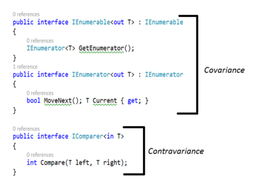

# [C# History](https://docs.microsoft.com/en-us/dotnet/csharp/whats-new/csharp-version-history#c-version-50)

## C# 1.0 (2002)

- Classes
- Structs
- Interfaces
- Events
- Properties
- Delegates
- Expressions
- Statements
- Attributes

## C# 2.0 (2005)

- **Generics**
- Partial types
- Anonymous methods
- Nullable value types
- **Iterators**
- Covariance and contravariance

- Getter/setter separate accessibility
- Method group conversions (delegates)
- Static classes
- Delegate inference

## C# 3.0 (2007) VS 2008, .Net FW 3.5

- Auto-implemented properties
- Anonymous types
- Query expressions (**LINQ**)
- **Lambda expressions**
- Expression trees
- **Extension methods**
- Implicitly typed local variables
- Partial methods
- Object and collection initializers

## C# 4.0 () VS2010

- Dynamic binding
- Named/optional arguments
- Generic Covariant and Contravariant
- Embedded interop types

## C# 5.0 ()VS2012

- **Asynchronous members**
- Caller info attributes

## C# 6.0 () VS2015

- Static imports
- Exception filters
- Auto-property initializers
- Expression bodied members
- Null propagator
- String interpolation ($"")
- nameof operator
- Index initializers

- Await in catch/finally blocks
- Default values for getter-only properties

## C# 7.0 ()VS2017

- Out variables
- Tuples and deconstruction
- Pattern matching
- Local functions
- Expanded expression bodied members
- Ref locals and returns
- Other features included:
- Discards
- Binary Literals and Digit Separators
- Throw expressions

## C# 8.0 () VS2019

- Readonly members
- Default interface methods
- Pattern matching enhancements
- Switch expressions
- Property patterns
- Tuple patterns
- Positional patterns
- Using declarations
- Static local functions
- Disposable ref structs
- Nullable reference types
- Asynchronous streams
- Indices and ranges
- Null-coalescing assignment
- Unmanaged constructed types
- Stackalloc in nested expressions
- Enhancement of interpolated verbatim strings

## C# Killer Features

### Generics (C# 2.0)

### Extension Method (C# 3.0)

### Lambda expression (C# 3.0)

### LINQ (C# 3.0) VS2008, .Net 3.5

### Task (2010)VS2010 .Net 4.0

### Async/Await (C# 5.0) .Net 4.5

### Reactive Extension

Parameter vs Argument
----

- A picture is worth a thousand words


What is The "Type" Class?
----

- To avoid confusions:

    + Use "Type" to refer to the "Type" Class or instances of it.

    + Use "type" to refer to an actual "type", such as String, int, string[], etc.

- An instance of "Type" has metadata about a given "type"---such as String, int, string[], etc. or instances of a "type".

- Two ways to get a "type's" "Type":

    + typeof() operator

        ```csharp
        var intType = typeof(int); // takes an actual type as its argument.
        ```
    + GetType() method --- came from the Object class

        ```csharp
        var intType = 12.GetType(); // calls an instance's GetType() method
        var intType = "aString".GetType(); // calls an instance's GetType() method, no argument passed.
        ```

What is the Usage of "Type"?
----

- Get tons of information about a "type"
- Once you get a hold of a "type's" "Type", you can find out a lot about the "type"---is it an array, what are its Properties, what is its Name, etc.
- Examples:

```csharp
var emp = new Employee();
var empType = emp.GetType();

var inWhichAssembly = empType.AssemblyQualifiedName;
var whatIsItsFullName = empType.FullName;
var isItValueType = empType.IsValueType;
var whatIsItsName = empType.Name
var whatIsItsNamespace = empType.Namespace;
var propertyInfos = empType.GetProperties();    // an array of PropertyInfo[]
    ...

```

Why all the Lambdas (like @Html.DisplayNameFor(Expression<TDeletegate>))
----

- [why](https://odetocode.com/blogs/scott/archive/2012/11/26/why-all-the-lambdas.aspx "Why all the Lambdas")

- [LINQ - Lambda Expression - Expression<T>](https://odetocode.com/articles/738.aspx)


Generics
----

- C# Generics can be applied to 

    + Interface
    + Abstract class
    + Class
    + Method
    + Static method
    + Property
    + Event
    + Delegates
    + Operator

- Generics enable us to work with type-safe collections and classes and methods that can accept a **type parameter**. 

- We can take advantage of generics to eliminate:
    + redundant code
    + enforce type safety, 
    + promote code re-usability and maintainability. 


Covariant (out) and Contravariant (in)
----

- Concepts come from **Category** theory
- Only applicable to reference types and not on value type. 
- Eanble implicit reference conversion for array, delegate and generic arguments.
- Convariant and Contravariant are opposite of each other.
- Invariant: no variance

- Definitions from MSDN:

    + Covariance and contravariance are terms that refer to the ability to use a less derived (less specific) or more derived type (more specific) than originally specified. Generic type parameters support covariance and contravariance to provide greater flexibility in assigning and using generic types.

- Covariant: an instance of a more derived type can be assigned to an instance of a less derived type

    ```csharp
    string str = "test";    // an instance of a more derived type of Object
    object obj = str;

    IEnumerable<string> strs = new List<string>();
    IEnumerable<object> objs = strs;
    ```

- Contravariant: an instance of a less derived type can be assigned to an instance of a more derived type.

    ```csharp
    // SetObj() is a method
    Action<object> actObj = SetObj;
    Action<string> actStr = actObj;
    ```

- A picture is worth a thousand words

    

```csharp
public interface IEnumerable<out T> : IEnumerable {
    IEnumerable<T> GetEnumerator();
}

public interface IEnumerator<out T> : IEnumerator
{
    bool MoveNext();
    T Current {get;}
}
```

- Explained:

    + So, it is evident that IEnumerable<Derived> is also IEnumerable<Base> if Derived type extends the Base type. 

    + In other words, if you have two types -- Derived and Base -- with the former inherited from the latter, the following statement holds good:

        ```csharp
            IEnumerable<Base> obj = new List<Derived>();
        ```
        + Note that obj in the above code snippet, is an instance of type IEnumerable<Base>. Now, since Object is the base of all types in .Net, the following statement is also valid.

            ```csharp
                IEnumerable<Object> obj = new List<String>();
            ```
    + Here's another example of covariance - this time using arrays. 
    + Refer to the code snippet given below that assigns a string array to an array instance of type object.

        ```csharp
            object[] objArray = new String[100];
        ```

- Contravariance works the opposite way covariance works.

    ```csharp
    public interface IComparer<in T>
    {
        int Compare(T left, T right);
    }
    ```

- Now suppose you have a comparer that can compare two objects.
- You can then use the same comparer to compare two strings as well.
- The reason this works is that the IComparer interface in .Net is contravariant in nature and its generic type parameter is marked with the "in" annotation.
- Another good example of contravariance is the Equals method that is used to compare two instances.
- If you have an Equals method that can compare two instances of a base type, you can use the same method to check for equality of two instances of a derived type (a type that extends the base type) as well.

- In C#, variance is supported in following scenarios:

    1. Covariance in arrays (C# 1.0)
    2. Covariance and Contra-variance in delegates (C# 2.0)
    3. Variance for generic type parameters in interfaces and delegates (C# 4.0)

- 1. Array Covariance

    + Arrays are covariance since C# 1.0
    + We can always do:

    ```csharp
    object[] obj = new String[10];
    ```
    + BUT, is considered **"not safe"**, because you can do:

    ```csharp
    obj[0] = 5; // it compiles, but throws an exception at run time because obj is in fact an array of strings, and can not container integers.
    ```

- 2. Delegate (aka method group) Variance (Co- and Contra-)

    + Since C# 2.0
    + Delegate return type is Covariant
    + Delegate parameter types are Contravariant
    + When you instantiate a delegate, you can assign it a method that has a more derived return type than that specified in the delegate (covariance). 
    + You can also assign a method that has parameter types less derived than those in the delegate (contravariance).

    ```csharp
    static object GetObject() {return null;}
    static void SetObject(object obj){}

    static string GetString() {return string.Empty();}
    static void SetString(string str){}

    static void Main()
    {
        // Covariance:
        // A delegate specifies a return type as Object -- Func<object>
        // Is assigned a method--GetString()--that returns a string.
        Func<object> del = GetString;

        // Contravariance:
        // A delegate specifies a parameter type of String
        // Is assigned a method--SetObject--that takes an object as parameter
        Action<string> del2 = SetObject;

        // But implicit conversion between generic delegates is not supported until C# 4.0
        Func<string> del3 = GetString;
        Func<object> del4 = del3; // Compiler error until C# 4.0
    }
    ```

- 3. Variance for Generic Type Parameters

    + The feature in C# 4.0. 
    + Now, when creating a generic interface, you can specify whether there is an implicit conversion between interface instances that have different type arguments.
    + For example, you can use an interface instance that has methods with more derived return types than originally specified (covariance) or that has methods with less derived parameter types (contravariance).
    + The same rules are applied to generic delegates.

    + While you can create variant interfaces and delegates yourself, this is not the main purpose for this feature.
    + What is more important is that a set of interfaces and delegates in .NET Framework 4 have been updated to become variant.

    + Here's the list of updated interfaces:

        IEnumerable<T> (T is covariant)
        IEnumerator<T> (T is covariant)
        IQueryable<T> (T is covariant)
        IGrouping<TKey, TElement> (TKey and TElement are covariant)
        IComparer<T> (T is contravariant)
        IEqualityComparer<T> (T is contravariant)
        IComparable<T> (T is contravariant)

    + And the list of updated delegates:

        Action<T> and Action<T1, T2> (T, T1, T2, and so on are contravariant)
        Func<TResult> and Func<T, TResult> (TResult is covariant; T, T1, T2, and so on are contravariant)
        Predicate<T> (T is contravariant)
        Comparison<T> (T is contravariant)
        Converter<TInput, TOutput> (TInput is contravariant; TOutput is covariant.)

Co- and Contra Variance Summary
----

- Covariance deals with:
    1. Array - define of less derived type, but create array of more derived type

    ```csharp
    object[] objs = new String[10]();
    ```

    2. Return type of delegates, defined of less derived return type, but can be assigned with a more derived return type.

    ```csharp
    class Mammals {}  
    class Dogs : Mammals {}  

    class Program  
    {  
        // Define a delegate with Mammal (aka the base) as the return type.  
        public delegate Mammals HandlerMethod();  

        public static Mammals MammalsHandler() {return null;}  
        public static Dogs DogsHandler() {return null;}  

        static void Test()  
        {  
            HandlerMethod handlerMammals = MammalsHandler;  

            // Covariance enables this assignment.  
            HandlerMethod handlerDogs = DogsHandler;  
        }  
    }  
    ```

- Contravariance deals with

    1. Parameter of delegates () - permits a method that has parameter types of less derived than those defined in the delegate type.

    ```csharp
    // delegates
    public delegate void KeyEventHandler(object sender, KeyEventArgs e);
    public delegate void MouseEventHandler(object sender, MouseEventArgs e);

    // Both KeyEventArgs and MouseEventArgs are subclasses of the EventArgs

    // Define a Event handler method that accepts a parameter of the EventArgs type.  
    private void MultiHandler(object sender, System.EventArgs e)  
    {  
        label1.Text = System.DateTime.Now.ToString();  
    }  

    public Form1()  
    {  
        InitializeComponent();  
        // You can use a method that takes an EventArgs parameter,  
        // although the event expects the KeyEventArgs parameter.  
        this.button1.KeyDown += this.MultiHandler;  

        // You can use the same method
        // for an event that expects the MouseEventArgs parameter.  
        this.button1.MouseClick += this.MultiHandler;  
    }  
    ```

- A picture is worth a thousand words


Action<TParam>, Func<TParam, TReturn>, Predicate<TParam> vs delegate
----

- delegate definition can specify variance for its return and parameter type

```csharp
public delegate TReturn // return type is Covariance
    SubcommandWrapperFunc<in TParam, in TParam2, out TReturn>(
        Guid reservationHandle,
        CancellationToken token,
        TParam param,   // param is Contravariance
        TParam2 param2);// param2 is Contravariance
```

- Action<TParam>, Func<TParam, TReturn>, Predicate can not! But do support variance at C# 4.0!!!

Static Reflection
----

- [Introduction to Static Reflection](http://www.jagregory.com/writings/introduction-to-static-reflection/)

- [Using Static Reflection to Get Property and Method names](http://joelabrahamsson.com/getting-property-and-method-names-using-static-reflection-in-c/)