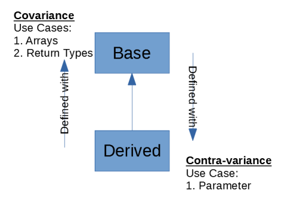
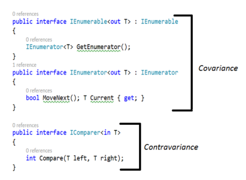

Covariance (out - return value) and Contravariance (in - parameter)
====

Co- and Contra Variance Summary (TL;DR)
----

- Variance (Co- and Contra-) are very simple concepts, trying to convey the **implicit conversion** rules for **array**, **delegate** and **generic interface**.

- But ironically, a lot of explanations, including those created by Microsoft, make it hard to understand, by introducing a lot of jargons which themselves are confusing.

- **Covariance** deals with:

    1. Array - defined as of less derived type, but can take array of more derived type

    ```csharp
    object[] objs = new String[10];
    ```

    2. Return type of delegates, defined as of less derived, but can be assigned with something of more derived type.

    ```csharp
    delegate TOutput Converter<in TInput, out TOutput>(TInput input);
    ```

- **Contravariance** deals with

    1. Parameter of delegates () - permits a method that has parameter types of less derived than those defined in the delegate type.

    ```csharp
    // delegates
    public delegate void KeyEventHandler(object sender, KeyEventArgs e);
    public delegate void MouseEventHandler(object sender, MouseEventArgs e);

    // Both KeyEventArgs and MouseEventArgs are subclasses of the EventArgs

    // Define a Event handler method that accepts a parameter of the EventArgs type.
    private void MultiHandler(object sender, System.EventArgs e)
    {
        label1.Text = System.DateTime.Now.ToString();
    }

    public Form1()
    {
        InitializeComponent();
        // You can use a method that takes an EventArgs parameter,
        // although the event expects the KeyEventArgs parameter.
        this.button1.KeyDown += this.MultiHandler;

        // You can use the same method
        // for an event that expects the MouseEventArgs parameter.
        this.button1.MouseClick += this.MultiHandler;
    }
    ```

- A picture is worth a thousand words



Boring Details
----

- Concepts come from **Category** theory
- Only applicable to reference types and **NOT** to value type.
- Enable implicit reference conversion for
  - array,
  - delegate,
  - generic interfaces' arguments.
- Covariant and Contra-variant are opposite of each other.
- Invariant: no variance

- **Covariance**: Enables you to use a more derived type than originally specified.
  - Producer.
  - eg: You can assign an instance of IEnumerable`<Derived>` to a variable of type IEnumerable`<Base>`.

- **Contravariance**: Enables you to use a more generic (less derived) type than originally specified.
  - Consumer.
  - You can assign an instance of Action`<Base>` to a variable of type Action`<Derived>`.

- **Invariance**: Means that you can use only the type originally specified; so an invariant generic type parameter is neither covariant nor contravariant.

  - You cannot assign an instance of List`<Base>` to a variable of type List`<Derived>` or vice versa.

- Definitions from MSDN:

  - Covariance and Contravariance are terms that refer to the ability to use a less derived (less specific) or more derived type (more specific) than originally specified. Generic type parameters support covariance and contra-variance to provide greater flexibility in assigning and using generic types.

- Covariant: an instance of a more derived type can be assigned to an instance of a less derived type:

    ```csharp
    string str = "test";    // an instance of a more derived type of Object
    object obj = str;

    // IEnumerable<T> is COvariant, because <T> is a return type.
    IEnumerable<Derived> manyDerived = new List<Derived>();
    IEnumerable<Base> manyBases = manyDerived;
    // --- eg:
    IEnumerable<string> strs = new List<string>();
    IEnumerable<object> objs = strs;
    ```

- Contravariant: an instance of a less derived type can be assigned to an instance of a more derived type.

    ```csharp

    // Action<T> is CONTRAvariant, because T is a parameter (Action has no return type)
    Action<Base> actBase = SetBase;
    Action<Derived> actDerived = actObj;

    // SetObj() is a method
    Action<object> actObj = SetObj;
    Action<string> actStr = actObj;
    ```

- Why IEnumerable`<T>` is a Covariant? A picture is worth a thousand words:

    

```csharp
public interface IEnumerable<out T> : IEnumerable {
    IEnumerable<T> GetEnumerator();
}

public interface IEnumerator<out T> : IEnumerator
{
    bool MoveNext();
    T Current {get;}    // T is a return value!!!!
}
```

- Explained:

  - So, it is evident that an IEnumerable`<Derived>` is also an IEnumerable`<Base>` if **Derived** type extends the **Base** type.

  - In other words, if you have two types -- Derived and Base -- with the former inherited from the latter, the following statement holds true:

    ```csharp
        IEnumerable<Base> obj = new List<Derived>();
    ```

  - Note: that obj in the above code snippet, is an instance of type IEnumerable`<Base>`. Now, since Object is the base of all types in .Net, the following statement is also valid.

    ```csharp
        IEnumerable<Object> obj = new List<String>();
    ```

  - Here's another example of covariance - this time using arrays.

  - Refer to the code snippet given below that assigns a string array to an array instance of type object.

    ```csharp
        object[] objArray = new String[100];
    ```

- Contravariance works the opposite way covariance works.

    ```csharp
        public interface IComparer<in T>
        {
            int Compare(T left, T right);
        }
    ```

- Now suppose you have a comparer that can compare two objects.
- You can then use the same comparer to compare two strings as well.
- The reason this works is that the IComparer interface in .Net is contravariant in nature and its generic type parameter is marked with the "in" annotation.
- Another good example of contravariance is the Equals method that is used to compare two instances.
- If you have an Equals method that can compare two instances of a base type, you can use the same method to check for equality of two instances of a derived type (a type that extends the base type) as well.

- In C#, variance is supported in following scenarios:

    1. Covariance in arrays (C# 1.0)
    2. Covariance and Contra-variance in delegates (C# 2.0)
    3. Variance for generic type parameters in interfaces and delegates (C# 4.0)

- 1. Array Covariance

  - Arrays are covariant since C# 1.0
    - We can always do:

    ```csharp
    object[] obj = new String[10];
    ```

  - BUT, is considered **"not type safe"**, because you can do:

    ```csharp
    obj[0] = 5; // it compiles, but throws an exception at run time because obj is in fact an array of strings, and it can not container integers.
    ```

- 2. Delegate (aka method group) Variant (Co- and Contra-)

  - Since C# 2.0
  - Delegate return type is Covariant
  - Delegate parameter types are Contravariant
  - When you instantiate a delegate, you can assign it a method that has a more derived return type than that specified in the delegate (covariance).
  - You can also assign a method that has parameter types less derived than those in the delegate (contravariance).

    ```csharp
    static object GetObject() {return null;}
    static void SetObject(object obj){}

    static string GetString() {return string.Empty();}
    static void SetString(string str){}

    static void Main()
    {
        // Covariance:
        // A delegate specifies a return type as Object -- Func<object>
        // Is assigned a method--GetString()--that returns a string.
        Func<object> del = GetString;

        // Contravariance:
        // A delegate specifies a parameter type of String
        // Is assigned a method--SetObject--that takes an object as parameter
        Action<string> del2 = SetObject;

        // But implicit conversion between generic delegates is not supported until C# 4.0
        Func<string> del3 = GetString;
        Func<object> del4 = del3; // Compiler error until C# 4.0
    }
    ```

- 3. Variance for **Generic Interface** Type Parameters

  - The feature in C# 4.0.
  - Now, when creating a generic interface, you can specify whether there is an implicit conversion between interface instances that have different type arguments.
  - For example, you can use an interface instance that has methods with more derived return types than originally specified (covariance) or that has methods with less derived parameter types (contravariance).
  - The same rules are applied to generic delegates.

  - While you can create variant interfaces and delegates yourself, this is not the main purpose for this feature.
  - What is more important is that a set of interfaces and delegates in .NET Framework 4 have been updated to become variant.

  - Here's the list of updated interfaces:

    IEnumerable`<T>` (T is covariant)
    IEnumerator`<T>` (T is covariant)
    IQueryable`<T> `(T is covariant)
    IGrouping`<TKey, TElement> `(TKey and TElement are covariant)
    IComparer`<T>` (T is contravariant)
    IEqualityComparer`<T>` (T is contravariant)
    IComparable`<T>` (T is contravariant)

  - And the list of updated delegates:

    Action<T> and Action<T1, T2> (T, T1, T2, and so on are contravariant)
    Func<TResult> and Func<T, TResult> (TResult is covariant; T, T1, T2, and so on are contravariant)
    Predicate<T> (T is contravariant)
    Comparison<T> (T is contravariant)
    Converter<TInput, TOutput> (TInput is contravariant; TOutput is covariant.)

    |Generics (Delegate/Interface)|    Covariant | Contravariant|
    |--|--|--|
    |Action`<T>`| |Yes|
    |Comparison`<T>`||Yes|
    |Converter`<TInput,TOutput>`|    Yes|    Yes|
    |Func`<TResult>`|    Yes    ||
    |Func`<T,TResult>`| Yes|Yes|
    |IComparable`<T>`||Yes|
    |Predicate`<T>`||Yes|
    |IComparer`<T>`||Yes|
    |IEnumerable`<T>`|Yes    ||
    |IEnumerator`<T>`|Yes    ||
    |IEqualityComparer`<T>`||Yes|
    |IGrouping`<TKey,TElement>`|Yes    ||
    |IOrderedEnumerable`<TElement>`|Yes    ||
    |IOrderedQueryable`<T>`|Yes||
    |IQueryable`<T>`| Yes||