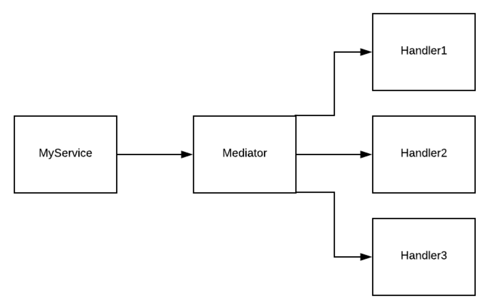

# Mediator - Design Pattern

What is a Mediator? 
----

- It's a class that encapsulates how different components (also are classes) can interact with each other---publishers and consumers.

- Its purpose is to promote loose coupling by not having components refer to each other, but instead only refer to the mediator. So, components (publishers) pass messages to the mediator, which will pass them on to the right components (consumers).

- A picture worth a thousand words



- Note: Mediator Pattern does allow two way communication.

- It is really a "In-Process Messaging" implementation.

Key Mediator Interfaces
---

- IRequest

```csharp
/// <summary>
/// Marker interface to represent a request with a void response
/// </summary>
public interface IRequest : IRequest<Unit> { }

/// <summary>
/// Marker interface to represent a request with a response
/// </summary>
/// <typeparam name="TResponse">Response type</typeparam>
public interface IRequest<out TResponse> : IBaseRequest { }

/// <summary>
/// Allows for generic type constraints of objects implementing IRequest or IRequest{TResponse}
/// </summary>
public interface IBaseRequest { }
```

- INotification

```csharp
/// <summary>
/// Marker interface to represent a notification
/// </summary>
public interface INotification { }
```

- INotificationHandler<INotification>

```csharp
/// <summary>
/// Defines a handler for a request
/// </summary>
/// <typeparam name="TRequest">The type of request being handled</typeparam>
/// <typeparam name="TResponse">The type of response from the handler</typeparam>
public interface IRequestHandler<in TRequest, TResponse>
    where TRequest : IRequest<TResponse>
{
    /// <summary>
    /// Handles a request
    /// </summary>
    /// <param name="request">The request</param>
    /// <param name="cancellationToken">Cancellation token</param>
    /// <returns>Response from the request</returns>
    Task<TResponse> Handle(TRequest request, CancellationToken cancellationToken);
}

/// <summary>
/// Defines a handler for a request with a void (<see cref="Unit" />) response.
/// You do not need to register this interface explicitly with a container as it inherits from the base <see cref="IRequestHandler{TRequest, TResponse}" /> interface.
/// </summary>
/// <typeparam name="TRequest">The type of request being handled</typeparam>
public interface IRequestHandler<in TRequest> : IRequestHandler<TRequest, Unit>
    where TRequest : IRequest<Unit>
{
}

/// <summary>
/// Wrapper class for a handler that asynchronously handles a request and does not return a response
/// </summary>
/// <typeparam name="TRequest">The type of request being handled</typeparam>
public abstract class AsyncRequestHandler<TRequest> : IRequestHandler<TRequest>
    where TRequest : IRequest
{
    async Task<Unit> IRequestHandler<TRequest, Unit>.Handle(TRequest request, CancellationToken cancellationToken)
    {
        await Handle(request, cancellationToken).ConfigureAwait(false);
        return Unit.Value;
    }

    /// <summary>
    /// Override in a derived class for the handler logic
    /// </summary>
    /// <param name="request">Request</param>
    /// <param name="cancellationToken"></param>
    /// <returns>Response</returns>
    protected abstract Task Handle(TRequest request, CancellationToken cancellationToken);
}

/// <summary>
/// Wrapper class for a handler that synchronously handles a request and returns a response
/// </summary>
/// <typeparam name="TRequest">The type of request being handled</typeparam>
/// <typeparam name="TResponse">The type of response from the handler</typeparam>
public abstract class RequestHandler<TRequest, TResponse> : IRequestHandler<TRequest, TResponse>
    where TRequest : IRequest<TResponse>
{
    Task<TResponse> IRequestHandler<TRequest, TResponse>.Handle(TRequest request, CancellationToken cancellationToken)
        => Task.FromResult(Handle(request));

    /// <summary>
    /// Override in a derived class for the handler logic
    /// </summary>
    /// <param name="request">Request</param>
    /// <returns>Response</returns>
    protected abstract TResponse Handle(TRequest request);
}

/// <summary>
/// Wrapper class for a handler that synchronously handles a request does not return a response
/// </summary>
/// <typeparam name="TRequest">The type of request being handled</typeparam>
public abstract class RequestHandler<TRequest> : IRequestHandler<TRequest>
    where TRequest : IRequest
{
    Task<Unit> IRequestHandler<TRequest, Unit>.Handle(TRequest request, CancellationToken cancellationToken)
    {
        Handle(request);
        return Unit.Task;
    }

    protected abstract void Handle(TRequest request);
}

```

- IMediator

```csharp
 public interface IMediator
{
    /// <summary>
    /// Asynchronously send a request to a single handler
    /// </summary>
    /// <typeparam name="TResponse">Response type</typeparam>
    /// <param name="request">Request object</param>
    /// <param name="cancellationToken">Optional cancellation token</param>
    /// <returns>A task that represents the send operation. The task result contains the handler response</returns>
    Task<TResponse> Send<TResponse>(IRequest<TResponse> request, CancellationToken cancellationToken = default);

    /// <summary>
    /// Asynchronously send an object request to a single handler via dynamic dispatch
    /// </summary>
    /// <param name="request">Request object</param>
    /// <param name="cancellationToken">Optional cancellation token</param>
    /// <returns>A task that represents the send operation. The task result contains the type erased handler response</returns>
    Task<object> Send(object request, CancellationToken cancellationToken = default);

    /// <summary>
    /// Asynchronously send a notification to multiple handlers
    /// </summary>
    /// <param name="notification">Notification object</param>
    /// <param name="cancellationToken">Optional cancellation token</param>
    /// <returns>A task that represents the publish operation.</returns>
    Task Publish(object notification, CancellationToken cancellationToken = default);

    /// <summary>
    /// Asynchronously send a notification to multiple handlers
    /// </summary>
    /// <param name="notification">Notification object</param>
    /// <param name="cancellationToken">Optional cancellation token</param>
    /// <returns>A task that represents the publish operation.</returns>
    Task Publish<TNotification>(TNotification notification, CancellationToken cancellationToken = default)
        where TNotification : INotification;
}
```

- Pipeline Behavior

```csharp
/// <summary>
/// Represents an async continuation for the next task to execute in the pipeline
/// </summary>
/// <typeparam name="TResponse">Response type</typeparam>
/// <returns>Awaitable task returning a <typeparamref name="TResponse"/></returns>
public delegate Task<TResponse> RequestHandlerDelegate<TResponse>();

/// <summary>
/// Pipeline behavior to surround the inner handler.
/// Implementations add additional behavior and await the next delegate.
/// </summary>
/// <typeparam name="TRequest">Request type</typeparam>
/// <typeparam name="TResponse">Response type</typeparam>
public interface IPipelineBehavior<in TRequest, TResponse>
{
    /// <summary>
    /// Pipeline handler. Perform any additional behavior and await the <paramref name="next"/> delegate as necessary
    /// </summary>
    /// <param name="request">Incoming request</param>
    /// <param name="cancellationToken">Cancellation token</param>
    /// <param name="next">Awaitable delegate for the next action in the pipeline. Eventually this delegate represents the handler.</param>
    /// <returns>Awaitable task returning the <typeparamref name="TResponse"/></returns>
    Task<TResponse> Handle(TRequest request, CancellationToken cancellationToken, RequestHandlerDelegate<TResponse> next);
}

```

Sample Implementation using MediatR (ASP.Net Core)
---

- Installing MediatR, using NuGet

```iecst
    Install-Package MediatR
    Install-Package MediatR.Extensions.Microsoft.DependencyInjection
```

- Configuring the Container, in Startup.cs

```csharp
    public void ConfigureServices(IServiceCollection services)
    {
        services.AddMediatR(Assembly.GetExecutingAssembly());
    }
```

- Creating Handlers
- Don't need to register them the MediatR will look through the assembly to find and register them.


```csharp
public class NotificationMessage : INotification
{
    public string TheNotification{ get; set; }
}
public class Notifier1 : INotificationHandler<NotificationMessage>
{
    public Task Handle(NotificationMessage note, CancellationToken token)
    {
        Debug.WriteLine($"from Notifier 1. Message  : {note.TheNotification} ");
        return Task.CompletedTask;
    }
}

public class Notifier2 : INotificationHandler<NotificationMessage>
{
    public Task Handle(NotificationMessage note, CancellationToken cancellationToken)
    {
        Debug.WriteLine($"from Notifier 2. Message  : {note.TheNotification} ");
        return Task.CompletedTask;
    }
}

```

- Not sure how much value it provides: If don't want the MediatR directly injected into the Controller, create a immediate MediatR Service, which will get injected with MediatR instance.

```csharp

public interface INotifierMediatorService
{
    void Notify(string notifyText);
}

public class NotifierMediatorService : INotifierMediatorService
{
    private readonly IMediator _mediator;

    public NotifierMediatorService(IMediator mediator)
    {
        _mediator = mediator;   // get injected with "mediator"
    }

    public void Notify(string notifyText)
    {
        _mediator.Publish(new NotificationMessage { NotifyText = notifyText });
    }
}

```

- Register the Service with DI container

```csharp
    services.AddTransient<INotifierMediatorService, NotifierMediatorService>();
```

- The Controller, using the Service

```csharp
public class HomeController : ControllerBase
{
    private readonly INotifierMediatorService _notifierMediatorService;

    public HomeController(INotifierMediatorService notifierMediatorService)
    {
        _notifierMediatorService = notifierMediatorService;
    }

    [HttpGet("")]
    public ActionResult<string> NotifyAll()
    {
        _notifierMediatorService.Notify("This is a test notification");
        return "Completed";
    }
}
```

Summary
----

- By using MediatR, the Controller is loosely couple with message handlers. 
- The Controller is not even aware of any handlers; it only need to send the message out.
- Handlers are auto register with MediatR, no need to manually do the registrations.

Further Usages:
----

- [Ref](https://github.com/jbogard/MediatR/wiki "MediatR Wiki")