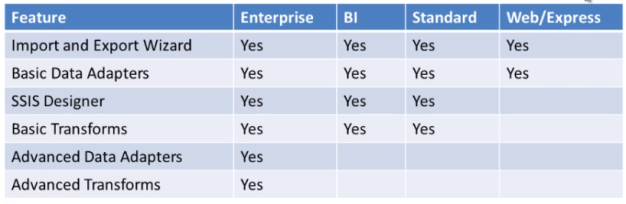
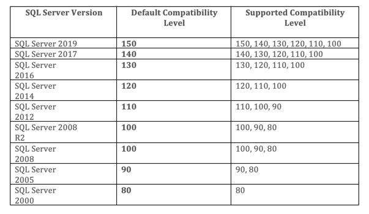

SSIS - Sql Server Integration Services
====

- One of the Services of SQL Servers
- Introduced in SQL Server 2005, replacing the legacy DTS (Data Transfer Service) in in SQL Server 2000. Note: that is why the SSIS package's extension is called dtsx

- Features Supported by SQL Server Editions

|Version	|Year	|Release|
|---|---|---|
|12.0|	2014|	SQL Server 2014|
|13.0	|2016	|SQL Server 2016|
|14.0	|2017	|SQL Server 2017|
|15.0	|2019	|SQL Server 2019 RC|

- SQL Server Compatibility Level

- Samples

> https://github.com/Microsoft/sql-server-samples/tree/master/samples/databases/wide-world-importers/sample-scripts

> https://github.com/Microsoft/sql-server-samples/releases/download/wide-world-importers-v1.0/WideWorldImporters-Full.bak

- [Ref](https://www.youtube.com/playlist?list=PL-dQAxjnbr650hO4iej02DLkwgdVuhALv)
- [Ref](https://www.sqlshack.com/ssis-ole-db-source-sql-command-vs-table-or-view/)

SSIS Toolbox
---

- To bring up the SSIS toolbox, right click on the Design space and select **SSIS Toolbox**

SSIS Tutorials
---

[Tutorial](https://www.mssqltips.com/sqlservertutorial/9053/sql-server-integration-services-ssis-2016-tutorial/)