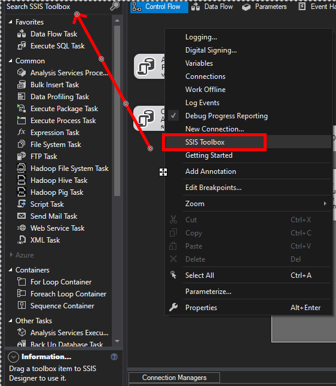

SSIS - Sql Server Integration Services
====

- Samples

> https://github.com/Microsoft/sql-server-samples/tree/master/samples/databases/wide-world-importers/sample-scripts

> https://github.com/Microsoft/sql-server-samples/releases/download/wide-world-importers-v1.0/WideWorldImporters-Full.bak

- [Ref](https://www.youtube.com/playlist?list=PL-dQAxjnbr650hO4iej02DLkwgdVuhALv)
- [Ref](https://www.sqlshack.com/ssis-ole-db-source-sql-command-vs-table-or-view/)

SSIS Toolbox
---

- To bring up the SSIS toolbox, right click on the Design space and select **SSIS Toolbox**

