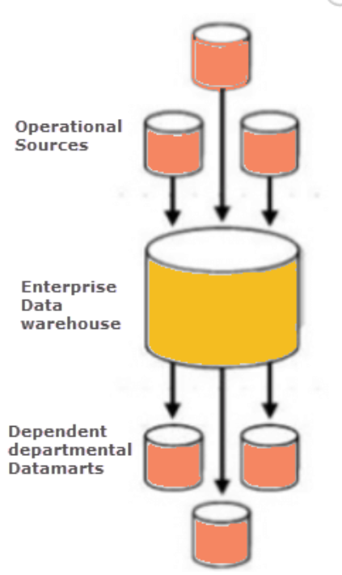
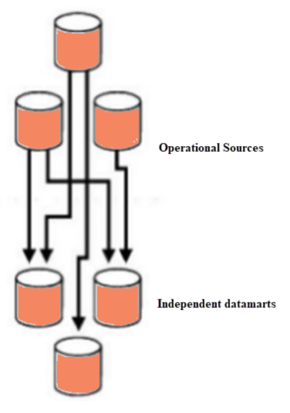
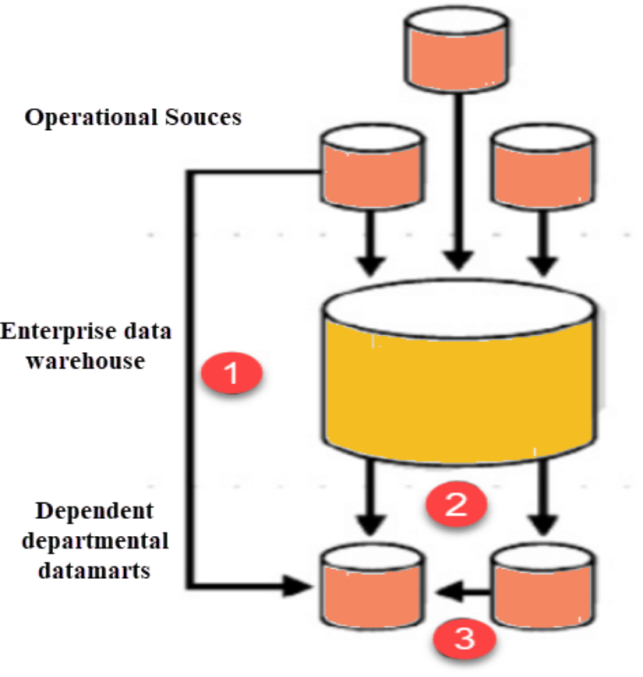

Data Mart
====

What is Data Mart
----

- A Data Mart is focused on a single functional area of an organization and contains a **subset** of data stored in a Data Warehouse
- Used and Controlled by a specific department in an organization---Marking, Sales, HR or Finance.

Why do we need Data Mart?
----

- Helps to enhance user's response time due to reduction in volume of data

- Provides easy access to frequently requested data.

- Are simpler to implement when compared to corporate Datawarehouse. At the same time, the cost of implementing Data Mart is certainly lower compared with implementing a full data warehouse.

- Compared to Data Warehouse, a Data Mart is agile. In case of change in model, Data Mart can be built quicker due to a smaller size.

- Is defined by a single **Subject Matter** Expert. On the contrary data warehouse is defined by interdisciplinary SME from a variety of domains. Hence, Data mart is more open to change compared to Datawarehouse.

- Is partitioned and allows very granular access control privileges.
Data can be segmented and stored on different hardware/software platforms.

Type of Data Mart
----

- **Dependent**: Dependent Data Marts are created by drawing data directly from operational, external or both sources.

- **Independent**: Independent data mart is created without the use of a central data warehouse.

- **Hybrid**: This type of data marts can take data from data warehouses or operational systems.

Dependent Data Mart
----

- allows sourcing organization's data from a single Data Warehouse. It offers the benefit of centralization. If you need to develop one or more physical data marts, then you need to configure them as dependent data marts.

- can be built in two different ways. Either where a user can access both the data mart and data warehouse, depending on need, or where access is limited only to the data mart. The second approach is not optimal as it produces sometimes referred to as a data junkyard. In the data junkyard, all data begins with a common source, but they are scrapped, and mostly junked.

Independent Data Mart
----

- Is created without the use of central Data warehouse.
- Is an ideal option for smaller groups within an organization.
- Has neither a relationship with the enterprise data warehouse nor with any other data mart. In Independent data mart, the data is input separately, and its analyses are also performed autonomously.

Hybrid data Mart:
----

- Combines input from sources apart from Data warehouse. 
- Could be helpful when you want ad-hoc integration, like after a new group or product is added to the organization.

- Is best suited for multiple database environments and fast implementation turnaround for any organization. 

- Requires least data cleansing effort. Hybrid Data mart also supports large storage structures, and it is best suited for flexible for smaller data-centric applications.

Summary
----

- A data mart is focused on a **single functional area** of an organization and contains a subset of data stored in a Data Warehouse.

- Data Mart helps to enhance user's response time due to a reduction in the volume of data.

- Three types of data mart are 1) Dependent 2) Independent 3) Hybrid

- Important implementation steps of Data Mart are 1) Designing 2) Constructing 3 Populating 4) Accessing and 5)Managing

- Data mart is cost-effective alternatives to a data warehouse, which can take high costs to build.

- Data Mart cannot provide company-wide data analysis as data set is limited.

[Credit](https://www.guru99.com/data-mart-tutorial.html)