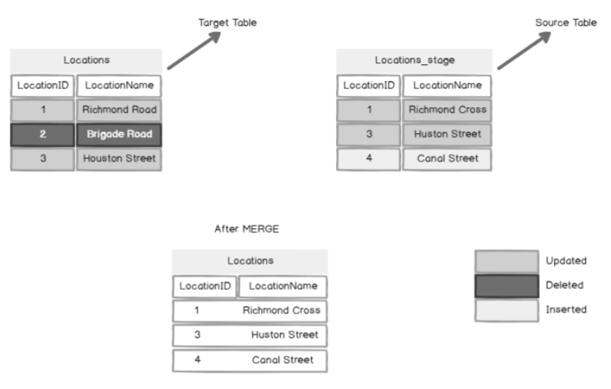

SQL - MERGE
===

- used to synchronize two tables by INSERTING, DELETING, and UPDATING the target table rows based on the join condition with the source table.

syntax:
---

```sql
    MERGE TOP (value) <target_table>
    USING <table_source>
    ON <merge_search_condition>
        [ WHEN MATCHED [ AND <clause_search_condition> ]
            THEN <merge_matched> ]
        [ WHEN NOT MATCHED [ BY TARGET ] [ AND <clause_search_condition> ]
            THEN <merge_not_matched> ]
        [ WHEN NOT MATCHED BY SOURCE [ AND <clause_search_condition> ]
            THEN <merge_matched> ]
        [ <output_clause> ]
        [ OPTION ( <query_hint> ) ]
    ;
```

Example (Setup)
---

```sql
    -- Target Table
    IF EXISTS (SELECT 1 FROM SYS.TABLES where name ='Locations')
    BEGIN
    DROP TABLE LOCATIONS
    END

    -- Source Table
    IF EXISTS (SELECT 1 FROM SYS.TABLES where name ='Locations_stage')
    BEGIN
    DROP TABLE LOCATIONS_STAGE
    END

    CREATE TABLE [dbo].[LOCATIONS](
        [LocationID] [int] NULL,
        [LocationName] [varchar](100) NULL)
    GO

    CREATE TABLE [dbo].[LOCATIONS_STAGE](
        [LocationID] [int] NULL,
        [LocationName] [varchar](100) NULL)
    GO

    INSERT INTO LOCATIONS values (1,'Richmond Road'),(2,'Brigade Road') ,(3,'Houston Street')

    INSERT INTO LOCATIONS_STAGE values (1,'Richmond Cross') ,(3,'Houston Street'), (4,'Canal Street')
```

Example (Using Merge to Update Matched Rows)
---

- WHEN MATCHED clause in SQL Server MERGE statement is used to UPDATE, DELETE the rows in the target table when the rows are matched with the source table based on the join condition.

- In this case, LOCATIONS is the target table, LOCATIONS_STAGE is the source table and the column LocationID is used in the join condition.

```sql
    MERGE LOCATIONS T
    USING LOCATIONS_STAGE S ON T.LocationID = S.LocationID
    WHEN MATCHED THEN
    UPDATE SET LocationName=S.LocationName;
```

Explained
---

- Rows with LocationID 1 and 3 are matched in the TARGET and SOURCE table as per the join condition and the value of LocationName in the TARGET was updated with the value of LocationName in the SOURCE table for both rows.

- Additional condition added to "WHEN MATCHED" clause

```sql
    MERGE LOCATIONS T
    USING LOCATIONS_STAGE S ON T.LocationID=S.LocationID
    WHEN MATCHED AND T.LocationID = 3 THEN
    UPDATE SET LocationName=S.LocationName;
```

- NOTE:

- At most, we can specify only (TWO) WHEN MATCHED clauses in the MERGE statement.
- If (TWO) WHEN MATCHED clauses are specified, one clause must have an UPDATE operation and the other one must use DELETE operation.

```sql
    MERGE LOCATIONS T
    USING LOCATIONS_STAGE S ON T.LocationID=S.LocationID
    WHEN MATCHED AND T.LocationID =3 THEN
    DELETE
    WHEN MATCHED AND T.LocationID =1 THEN
    UPDATE SET LocationName=S.LocationName;
```

- NOTE:

- When there is more than one row in the SOURCE table that matches the join condition, the UPDATE in SQL Server MERGE statement fails and returns error “The MERGE statement attempted to UPDATE or DELETE the same row more than once.

- This happens when a TARGET row matches more than one SOURCE row.

A MERGE statement cannot UPDATE/DELETE the same row of the target table multiple times.
---

- Use ON clause to ensure a target row matches at most one source row,
- OR use the GROUP BY clause to group the source rows.”

- Using MERGE to INSERT rows in TARGET table

- WHEN NOT MATCHED BY TARGET clause is used to insert rows into TARGET table that does not match join condition with a SOURCE table.
- WHEN NOT MATCHED BY TARGET clause can be SPECIFIED ONLY ONCE in the SQL Server MERGE statement.

- For example, the row with LocationID = 4 in the table Locations_stage does not match join condition and is present in the source table only.

- Now when we use WHEN NOT MATCHED BY TARGET clause in the MERGE statement to insert the additional row from LOCATIONS_STAGE into LOCATIONS.

```sql
    MERGE LOCATIONS T
    USING LOCATIONS_STAGE S ON T.LocationID=S.LocationID
    WHEN NOT MATCHED BY TARGET
    THEN
    INSERT (LocationID,LocationName) VALUES (S.LocationID, S.LocationName);
```

Using MERGE to DELETE the rows in the target
---

- We can use WHEN NOT MATCHED BY SOURCE clause in SQL Server MERGE statement to DELETE the rows in the TARGET table that does not match join condition with a SOURCE table.

- For example, the row with locationID = 2 in the TARGET table does not match the join condition and the row is present only in the TARGET table.

- So, when we use WHEN NOT MATCHED BY SOURCE and can either DELETE the row or UPDATE it.

- Please refer to the below T-SQL script to delete the row in the target table using WHEN NOT MATCHED BY SOURCE clause.

```sql
    MERGE LOCATIONS T
    USING LOCATIONS_STAGE S ON T.LocationID=S.LocationID
    WHEN NOT MATCHED BY SOURCE
    THEN
    DELETE;
```

- NOTE:

- WHEN NOT MATCHED BY SOURCE clause can be specified two times, BUT one MUST use an UPDATE operation and another one MUST use DELETE operation.

```sql
    MERGE LOCATIONS T
    USING LOCATIONS_STAGE S ON T.LocationID=S.LocationID
    WHEN NOT MATCHED BY SOURCE AND LocationID =2
    THEN
    DELETE
    WHEN NOT MATCHED BY SOURCE AND LocationID =6
    THEN
    UPDATE SET LocationName ='Test';
```

- NOTE:

- We can use all the three clauses in the single MERGE statement to synchronize the TARGET table with the SOURCE table.

```sql

    MERGE LOCATIONS T
    USING LOCATIONS_STAGE S ON T.LocationID=S.LocationID
    
    WHEN MATCHED THEN
    UPDATE SET LocationName=S.LocationName
    
    WHEN NOT MATCHED BY TARGET 
    THEN 
    INSERT (LocationID,LocationName)
    VALUES (S.LocationID,S.LocationName)
    
    WHEN NOT MATCHED BY SOURCE 
    THEN 
    DELETE;

```




The TOP clause in MERGE
---

- A TOP clause in the MERGE statement is used to limit the number of rows affected. 
- A TOP clause is applied after removing all the rows that do not qualify for the INSERT, UPDATE, and DELETE operations. 

```sql
    MERGE top (1) LOCATIONS T
    USING LOCATIONS_STAGE S ON T.LocationID=S.LocationID
    
    WHEN MATCHED THEN
    UPDATE SET LocationName=S.LocationName
    
    WHEN NOT MATCHED BY TARGET 
    THEN 
    INSERT (LocationID,LocationName) VALUES (S.LocationID,S.LocationName)
    
    WHEN NOT MATCHED BY SOURCE 
    THEN 
    DELETE;
```

Explained
---

- We can see only the row with LocationID =1 is UPDATED and the rows that were WHEN NOT MATCHED BY SOURCE are not DELETED and the rows that were WHEN NOT MATCHED BY TARGET are not INSERTED.

- The OUTPUT clause in MERGE

- OUTPUT clause in the merge statement will return ONE ROW for EACH ROW that is MODIFIED in the TARGET table. 

- $action is used to know whether the row in the TARGET table is DELETED, INSERTED, or UPDATED. 

- Following T-SQL script is the example of the OUTPUT clause in the MERGE statement.

```sql
    MERGE LOCATIONS T
    USING LOCATIONS_STAGE S ON T.LocationID=S.LocationID
    
    WHEN MATCHED THEN
    UPDATE SET LocationName=S.LocationName
    
    WHEN NOT MATCHED BY TARGET 
    THEN 
    INSERT (LocationID,LocationName) VALUES (S.LocationID,S.LocationName)
    
    WHEN NOT MATCHED BY SOURCE 
    THEN 
    DELETE

    OUTPUT DELETED.*, $action AS [Action], INSERTED.* ;
```

Explained
---

- Image below shows the output of the above script which shows ACTION and the INSERTED and DELETED data in SQL Server MERGE statement. 

- Can also INSERT the output data in another table if want to track or audit changes later.


Using Merge on Table with Triggers
---

- If there is an INSTEAD OF TRIGGERS on the TARGET table, we MUST create INSTEAD OF TRIGGERS for all the DML actions specified in the MERGE statement. 

- If we create only INSTEAD OF INSERT trigger on the target table and specify INSERT, DELETE AND UPDATE operation in the MERGE statement, it throws an error.

```sql
    IF EXISTS (SELECT 1 FROM SYS.TABLES where name ='Locations')
    BEGIN 
    DROP TABLE Locations
    END

    IF EXISTS (SELECT 1 FROM SYS.TABLES where name ='Locations_stage')
    BEGIN 
    DROP TABLE Locations_stage
    END
    
    CREATE TABLE [dbo].[Locations](
        [LocationID] [int] NULL,
        [LocationName] [varchar](100) NULL) 
    GO
    
    CREATE TABLE [dbo].[Locations_stage](
        [LocationID] [int] NULL,
        [LocationName] [varchar](100) NULL) 
    GO
    
    INSERT INTO Locations values (1,'Richmond Road'),(2,'Brigade Road') ,(3,'Houston Street')
    INSERT INTO Locations_stage values (1,'Richmond Cross') ,(3,'Houston Street'), (4,'Canal Street')
    GO
    
    CREATE TRIGGER TEMP ON Locations
    INSTEAD OF INSERT, UPDATE, DELETE   -- must specify all 3 DMLs!!!
    AS
    BEGIN
    PRINT 'Hello'
    END
    GO
    
    MERGE Locations T
    USING Locations_stage S ON T.LocationID=S.LocationID
    
    WHEN MATCHED THEN
    UPDATE SET LocationName=S.LocationName
    
    WHEN NOT MATCHED BY TARGET 
    THEN 
    INSERT (LocationID,LocationName) VALUES (S.LocationID,S.LocationName)
    
    WHEN NOT MATCHED BY SOURCE 
    THEN 
    DELETE;
```

- NOTE:

- If TARGET table has any trigger, cannot use the OUTPUT clause in SQL Server MERGE statement directly.

- In that case, must create a table and use INSERT INTO to insert the output data into the newly created table.

- Please refer to the below example for the trigger on the target table and output clause in the MERGE statement.

```sql
    IF EXISTS (SELECT 1 FROM SYS.TABLES where name ='Locations_stage')
    BEGIN 
    DROP TABLE Locations_stage
    END
    
    IF EXISTS (SELECT 1 FROM SYS.TABLES where name ='Locations')
    BEGIN 
    DROP TABLE Locations
    END
    
    CREATE TABLE [dbo].[Locations](
        [LocationID] [int] NULL,
        [LocationName] [varchar](100) NULL) 
    GO
    
    CREATE TABLE [dbo].[Locations_stage](
        [LocationID] [int] NULL,
        [LocationName] [varchar](100) NULL) 
    GO
    
    CREATE TABLE #Output (
        DLocationID INT, 
        DLocationName VARCHAR(100),  
        ActionTaken nvarchar(10),  
        ILocationID INT,  
        ILocationName VARCHAR(100) )
    GO
    
    INSERT INTO Locations values (1,'Richmond Road'),(2,'Brigade Road') ,(3,'Houston Street')
    INSERT INTO Locations_stage values (1,'Richmond Cross') ,(3,'Houston Street'), (4,'Canal Street')
    GO
    
    CREATE TRIGGER test_1 on Locations
    FOR INSERT
    AS
    BEGIN
    PRINT 'HELLO'
    END
    GO

    MERGE Locations T
    USING Locations_stage S ON T.LocationID=S.LocationID

    WHEN MATCHED THEN
    UPDATE SET LocationName=S.LocationName
    
    WHEN NOT MATCHED BY TARGET 
    THEN 
    INSERT (LocationID,LocationName)
    VALUES (S.LocationID,S.LocationName)
    
    WHEN NOT MATCHED BY SOURCE 
    THEN 
    DELETE

    OUTPUT DELETED.*, $action AS [Action], INSERTED.* INTO #Output ;
```


Alternatively, there are different ways to sync the SOURCE and TARGET table. 
---

- Let us see an example by using a LEFT OUTER JOIN to INSERT, DELETE rows and INNER JOIN to UPDATE matched rows. 

- But we must write three different statements for synchronizing the tables.

- Please refer to below T-SQL script which uses 

```sql
    -- LEFT OUTER JOIN to DELETE rows present only in the target table.
    DELETE T FROM Locations T 
    LEFT OUTER JOIN Locations_stage S on T.LocationID=S.LocationID
    WHERE S.LocationID IS NULL

    -- Use INNER JOIN to UPDATE rows that match the join condition.
    update t set LocationName=s.LocationName from Locations t 
    inner join Locations_stage s on t.LocationID=s.LocationID

    -- LEFT OUTER JOIN to INSERT new rows which are present only in SOURCE table
    INSERT INTO Locations(LocationID,LocationName)
    select  t.LocationID,T.LocationName FROM Locations_stage T 
    LEFT OUTER JOIN Locations S on T.LocationID=S.LocationID
    WHERE S.LocationID IS NULL
```

CAUTION
---

- Keep in mind, for local temp table (#)

1. Temp table can only be (see it) visible to the connection that created it
2. Temp table will be dropped when the connection is terminated
3. If Temp table is created inside a STORED PROCEDURE, it will only available inside the STORED PROCEDURE, and will be dropped when STORED PROCEDURE is ended.

- Global (##) temp table can be accessed across all sessions 

- Make sure have proper indexes on BOTH tables and JOIN ONLY THE REQUIRED COLUMNS so that you do not run into performance issues while synchronizing tables.

- [Ref](https://www.sqlshack.com/sql-server-merge-statement-overview-and-examples/)